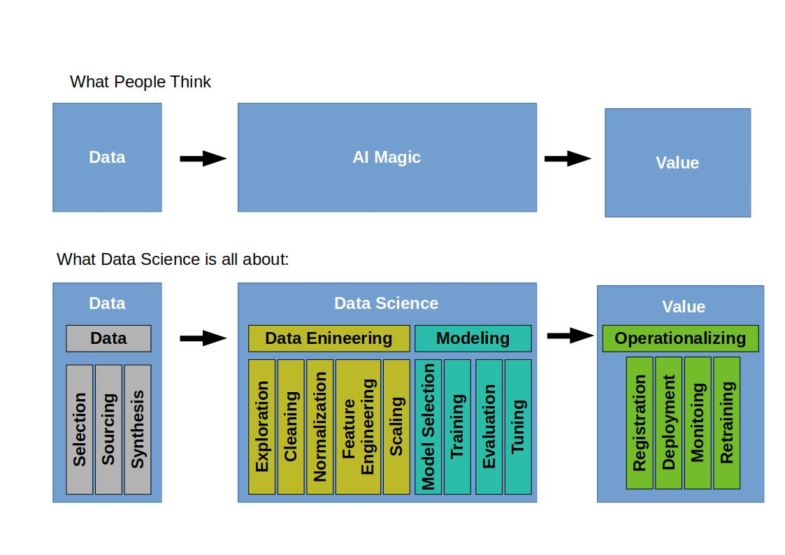
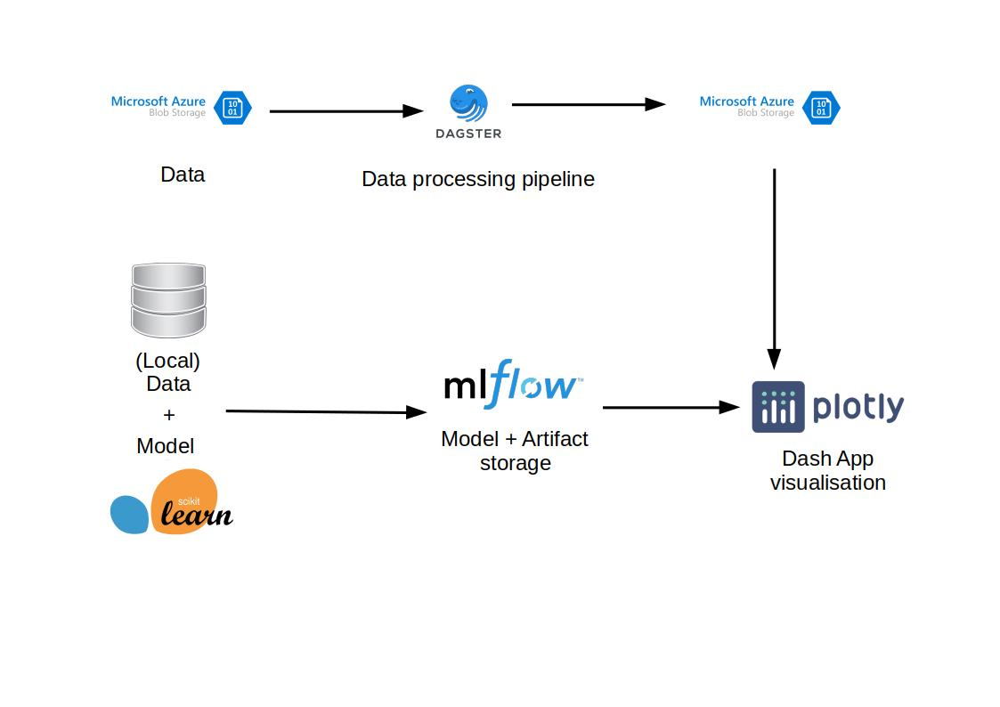

# data_science_tutorials

This Repo will consist of several tutorials folders and descriptions. 

**Please don`t blame me while not everything is right in place on time.** 

This repo will grow by time and is mainly based on text book examples out of the Six Sigma context.

We will try to use the data provided and go step by step through the whole examples, with new data on each step and new findings and techniques to learn in between.

We will try to use mlflow, sklearn_to_mlflow repos to fullfil the task.

Step by step we will grow our tool stack.

## Tool Stack

- [MLflow](https://github.com/heiko1234/mlflow)

- [SKlearn_to_mlflow](https://github.com/heiko1234/SKlearn_to_MLFLow)

## Tutorials to try:

- [tool_stack](./tool_stack/) will deal with basic information about the tools and packages that we use

- [virtual_environments](./virtual_environments) will deal with a very basic thing. How to setup a virtual environment. Easy and fast basics

- [mlflow](./mlflow_tutorial) will deal with basics of mlflow 

- [polymer_process_improvement](./polymer_process_improvement/) will deal with a typical chemical process improvement 

- [pricing_management_of_chemical_supplier](./price_management/) wll deal with an improvement on pricing of chemical goods.

## Tutorials in planing:

- [dash_app]

- [dagster_pipelines]

- [quality_of_anodized_parts]

## Usage of Tools

## How to use the python scripts

I personally don't like jupiter notebooks. You don't need them. If you like to execute one single line in an python file, execute it with ` "SHIFT" + "ENTER" `. Some of these scripts have a main function. They can be run as a script and get executed totally.

# Literatur used:

- Visual Six Sigma, Second Edition, Wiley, 2016, Cox, Gaudard, Stephens, ISBN: 976-1-118-90568-5  

- Beginning MLOps with MLFlow: Deploy Models in AWS SageMaker, Google Cloud and Microsoft Azure, Apress, 2020, Alla, Adari, ISBN: 978-1484265482

