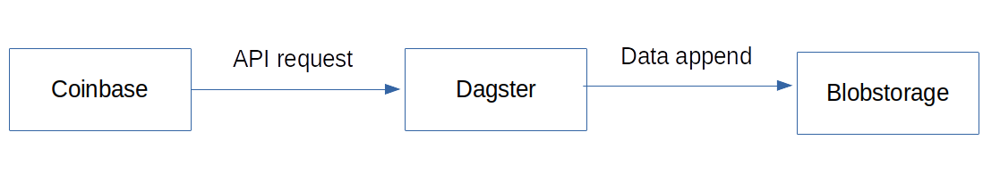

# Dagster Pipeline

In this tutorial I will provide an introduction on how to use dagster pipelines.

## Dagster

We use [Dagster](https://docs.dagster.io/getting-started) to create pipelines to automate our data preparation. 

## Pipeline Idea

In this project we like to grap some data on regular data. My idea is to collect some data from an public endpoint, like [Coinbase](https://www.coinbase.com/). We request only a few data and save them. Later on (not yet implemented) we append these data to one file.

So, the pipeline should be very easy. Grap data via a coinbase api as a dagster function (smalles dagster function is called op). Then we upload these data as file to the blobstorage (on azurite).

The connection of these ops, is called graph. Adding some resources to the graph and give it a modus (local or on azure) transform the graph to a job that is then executed.

Maybe we later create a sensor and append new data to the already existing data in our blob container.

[Part2](./dagster_pipeline_part2.md)

