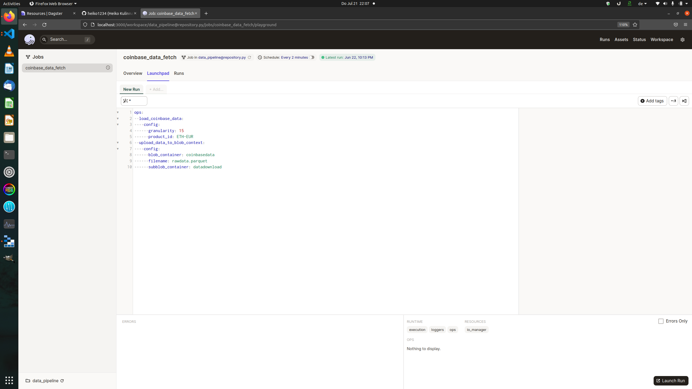
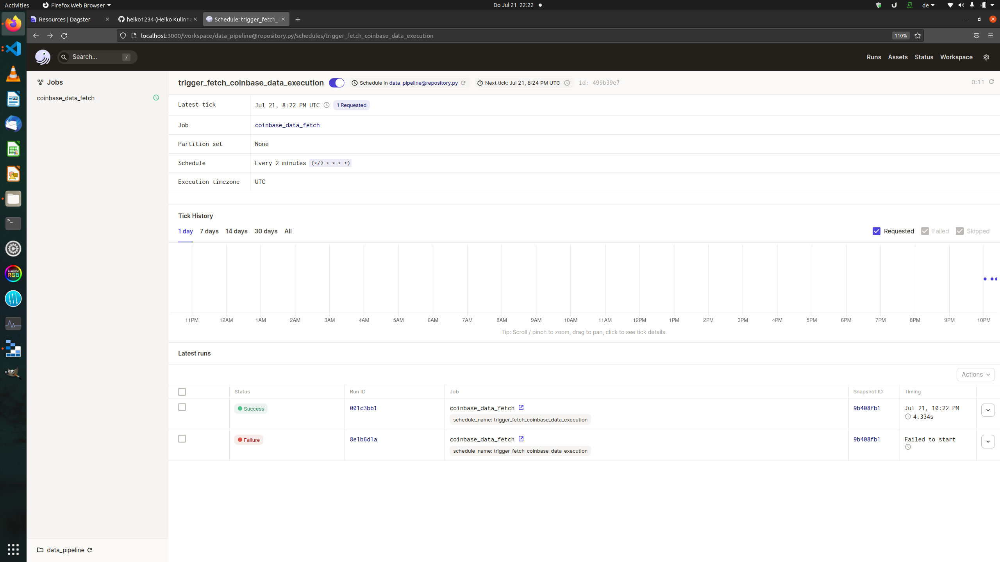
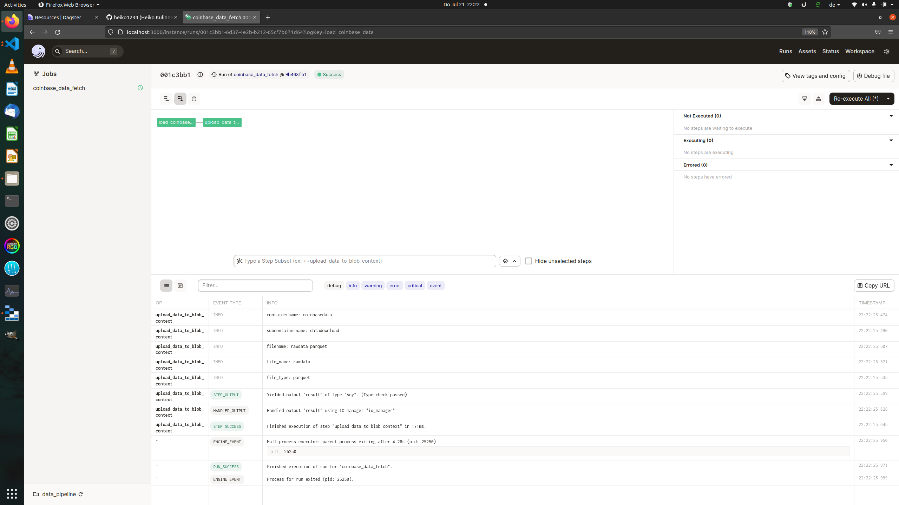

# Basics to make dagster run

## Environment Variables

Within Dagster we use the Blobstorage Connector.

So we need to provide the Azure Connection String and also the Account and the Key variable.

We may also need to set the DAGSTER_HOME Variable as absolut path for dagster.


```bash

# DAGSTER_HOME = './.dagster_home'

# DAGSTER_HOME="/home/heiko/Repos/dagster/.dagster"

AZURE_STORAGE_CONNECTION_STRING="DefaultEndpointsProtocol=http;AccountName=devstoreaccount1;AccountKey=Eby8vdM02xNOcqFlqUwJPLlmEtlCDXJ1OUzFT50uSRZ6IFsuFq2UVErCz4I6tq/K1SZFPTOtr/KBHBeksoGMGw==;BlobEndpoint=http://localhost:10000/devstoreaccount1;QueueEndpoint=http://localhost:10001/devstoreaccount1"

AZURE_STORAGE_ACCOUNT="devstoreaccount1"

AZURE_ACCOUNT_KEY="Eby8vdM02xNOcqFlqUwJPLlmEtlCDXJ1OUzFT50uSRZ6IFsuFq2UVErCz4I6tq/K1SZFPTOtr/KBHBeksoGMGw=="

```


## Dagit UI startup


Now, lets run the repository.py file on dagster.

The Dagster Daemon is for the schedulers and dagit to visualize the pipelines.

These commands should be executed in `bash`, so open two bash windows.

```bash
# execute in bash not powershell

DAGSTER_HOME=$(pwd)/.dagster dagster-daemon run

DAGSTER_HOME=$(pwd)/.dagster dagit -f ./pipelines/repository.py

```


## Dagit

### local Launchpad

[localhost](http://localhost:3000/)

```bash

ops:
  load_coinbase_data:
    config:
      granularity: 15
      product_id: ETH-EUR
  upload_data_to_blob_context:
    config:
      blob_container: coinbasedata
      filename: rawdata.parquet
      subblob_container: datadownload

```





### Scheduler








[Part5](./dagster_pipeline_part5.md)


