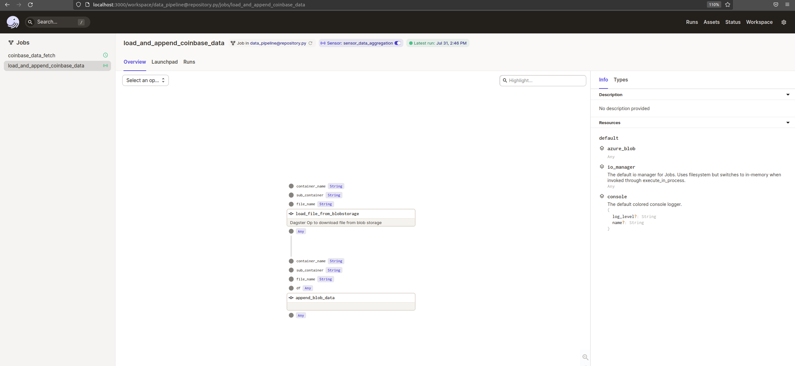
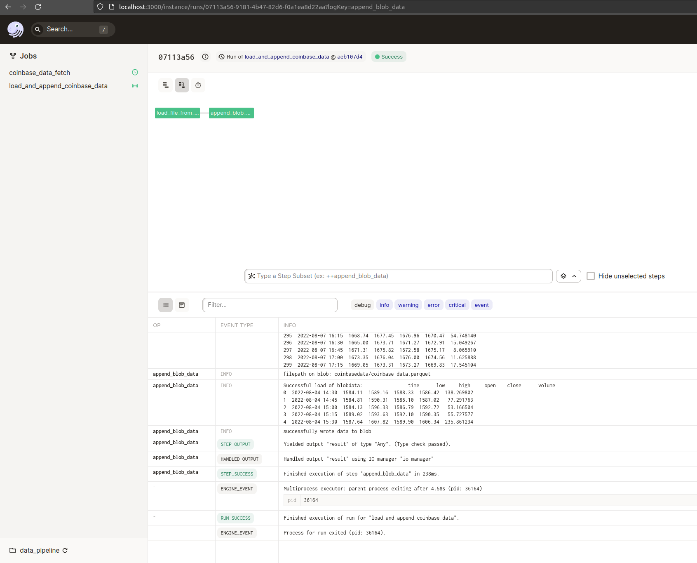

# Deeper into the Rabbit Hole of Dagster

We have collected some data of Coinbase with our pipeline so far. 

There is a small problem, we always overwrite these data and these data are not all data that are available. 

Our data call of Coinbase API gives us only a few days.

Since we do not want to make a prove of work, we really like to work with the data, we need more of them.

We need to save these data, we need to append these data to the existing data.


So let's make a second pipeline that uses the scheduled data downloads and append them to one big data file or into a database.

# Create the next level data

We extend our pipeline setup

```bash

|
|- pipelines
    |- general
        |- utility.py
        |- resources.py
    |- job_append_data
        |- aggregation.yaml
        |- op.py
        |- graph.py
        |- job.py
        |- trigger.py
    |- job_fetch_coinbase_data
        |- op.py
        |- graph.py
        |- job.py
        |- trigger.py

```


## OP

We create 2 OPs: 

- load_file_from_blobstorage
- append_blob_data


Both ops will use informations comming from the trigger but this time we give the informations to the input of the functions and not via the context.

Therefor we give the inputs (as `ins`) with dagster_types into the `@op` decorator.

Loading and Appending Data Functions are very similar to the already created and used functions.


We need also something special things in the @op decorator: We add a requried resources: `required_resource_keys={"azure_blob"}`

While using this, we also need a special way of calling this resources: 

`client = context.resources.azure_blob.blob_client.get_blob_client(container=container_name, blob=strblobpath)`


```bash


import io
import os
from dagster import op
from dagster import In, Out
import pandas as pd
from pathlib import Path

from pipelines.general.resources import (
    azurite_resource
)


@op(ins={"container_name": In(dagster_type=str),
    "sub_container": In(dagster_type=str), 
    "file_name": In(dagster_type=str)},
    required_resource_keys={"azure_blob"}
)
def load_file_from_blobstorage(context, container_name, sub_container, file_name):
    """Dagster Op to download file from blob storage

    Args:
        context (str): _description_
        cointainer_name (str): a string of containername
        sub_container (str): a string of subcontainername
        file_name (str): a string of the file
    """
    context.log.info(f"containername: {container_name}")
    context.log.info(f"subcontainer: {sub_container}")
    context.log.info(f"filename: {file_name}")

    strblobpath = f"{sub_container}/{file_name}"
    context.log.info(f"filepath on blob: {strblobpath}")

    client = context.resources.azure_blob.blob_client.get_blob_client(
        container=container_name, blob=strblobpath
    )
    bytes = client.download_blob().readall()
    pq_file = io.BytesIO(bytes)

    df = pd.read_parquet(pq_file)

    context.log.info(f"df: {df.head()}")

    return df


@op(ins={"container_name": In(dagster_type=str),
    "sub_container": In(dagster_type=str), 
    "file_name": In(dagster_type=str)},
    required_resource_keys={"azure_blob"}
)
def append_blob_data(context, df, container_name, sub_container, file_name):
    context.log.info(f"containername: {container_name}")
    context.log.info(f"subcontainer: {sub_container}")
    context.log.info(f"filename: {file_name}")
    context.log.info(f"df: {df.head()}")
    context.log.info(f"df: {df.tail()}")

    strblobpath = f"{sub_container}/{file_name}"
    context.log.info(f"filepath on blob: {strblobpath}")

    try:

        client = context.resources.azure_blob.blob_client.get_blob_client(
            container=container_name, blob=strblobpath
        )
        bytes = client.download_blob().readall()
        pq_file = io.BytesIO(bytes)

        df_exist = pd.read_parquet(pq_file)
        context.log.info(f"Successful load of blobdata: {df.head()}")

    except BaseException:
        context.log.info("No data available")
        df_exist = None

    df_list = [df_exist, df]
    new_df = pd.concat(df_list)

    new_df = new_df.drop_duplicates(keep="first")

    new_df = new_df.reset_index(drop=True)

    relative_file_name = f"./data/{sub_container}/{file_name}"
    file = Path(relative_file_name)
    dir_to_create = file.parent
    os.makedirs(dir_to_create, exist_ok=True)

    new_df.to_parquet(relative_file_name)

    client = context.resources.azure_blob.blob_client.get_blob_client(
        container=container_name, blob = f"{sub_container}/{file_name}"
    )
    with file.open("rb") as data:
        client.upload_blob(data, overwrite=True)
    context.log.info(f"successfully wrote data to blob")

    Path(relative_file_name).unlink()

```


## Graph

The graph is very simple. Load the data and use the append op function.

```bash

from dagster import graph

from pipelines.job_append_data.op import (
    load_file_from_blobstorage,
    append_blob_data
)

@graph()
def aggregate_data_graph():

    df = load_file_from_blobstorage()

    append_blob_data(df=df)

```


## Job

In the job file we have to define the resources.

We load the `azurite_resource` from the `general`/`resources` folder and define the `azure_blob` resource in the `to_job` function. 


```bash

from pipelines.general.resources import azurite_resource

from dagster import job, resource

from pipelines.job_append_data.graph import (
    aggregate_data_graph
)

job_data_aggregation = aggregate_data_graph.to_job(
    name="load_and_append_coinbase_data",
    resource_defs={
        "azure_blob": azurite_resource
    }
)

```

## Config File


The aggregation.yaml is very simple

We define a source subfolder, a target subfolder and also the names of the files that we like to load.

```bash

blob_container: "coinbasedata"

source_subcontainer: "datadownload"
source_file_name: "rawdata.parquet"

target_subcontainer: "coinbasedata"
target_file_name: "coinbase_data.parquet"

```


## Trigger

This time the trigger will be a sensor.

We have a config file and load these informations into the sensor.

The sensor checks the two files: 
- rawdata 
- appended data
of Coinbase data.


We parse the information to the inputs of the op functions with the keyword `inputs`

```bash

yield RunRequest(
    run_key=f"updated_timestamp_{actual_time}",
    run_config= {
        "ops": {
            "load_file_from_blobstorage":{
                "inputs":{
                    "container_name": variable
                }
            }
        }
    }
)

```

Let's have a short look back when we parsed these information with the scheduler. 

```bash
    output = {
        "ops":
            {
                "load_coinbase_data":
                    {"config": 
                        {
                            "product_id": "ETH-EUR",
                            "granularity": 15   #Min
                        }
                    },
```

See, the difference is not that big. :D

Here is the complete script of the sensor.


```bash

import datetime

from dagster import RunRequest, SkipReason, sensor

from pipelines.job_append_data.job import (
    job_data_aggregation
)
from pipelines.general.resources import (
    BlobStorageConnector,
    # get_list_files_in_subcontainer
)
from pipelines.general.utility import (
    get_missing_elements,
    read_configuration
)

@sensor(job=job_data_aggregation, minimum_interval_seconds=60)
def sensor_data_aggregation(context):

    config = read_configuration(configuration_file_path="./pipelines/job_append_data/aggregation.yaml")

    blob_container = config["blob_container"]
    source_subblob_container = config["source_subcontainer"]
    source_file_name= config["source_file_name"]
    target_subblob_container = config["target_subcontainer"]
    target_file_name = config["target_file_name"]

    DataFetcher = BlobStorageConnector(container_name=blob_container)

    try: 
        target_file = DataFetcher.get_parquet_file(
            subcontainer=target_subblob_container, file=target_file_name
        )
    except BaseException:
        target_file = None


    source_file = DataFetcher.get_parquet_file(
        subcontainer=source_subblob_container, file=source_file_name
    )

    actual_time = datetime.datetime.now().strftime("%Y-%m-%d %H:%M")

    last_source_date=list(source_file.loc[:, "time"])[-1]

    try: 
        last_target_date = list(target_file.loc[:,"time"])[-1]
    except BaseException:
        last_target_date = None

    if last_source_date == last_target_date:
        yield SkipReason(skip_message= "data are up-to-date")
    
    else:

        context.update_cursor(str(actual_time))

        yield RunRequest(
            run_key=f"updated_timestamp_{actual_time}",
            run_config= {
                "ops": {
                    "load_file_from_blobstorage":{
                        "inputs":{
                            "container_name": blob_container,
                            "sub_container": source_subblob_container,
                            "file_name": source_file_name
                        }
                    },
                    "append_blob_data":{
                        "inputs":{
                            "container_name": blob_container,
                            "sub_container": target_subblob_container,
                            "file_name": target_file_name
                        }
                    }
                }
            }
        )

```

## Let's run it

To also have this pipeline available, we need to add these things to the repo file of dagster. 

We load the pipeline and also the trigger of the new pipeline and add them to the return of data_pipeline function within the repository.py file.

```bash
# repository.py in root

from dagster import repository

from pipelines.job_fetch_coinbase_data.job import (
    job_fetch_coinbase_data
)
from pipelines.job_fetch_coinbase_data.trigger import (
    trigger_fetch_coinbase_data_execution
)
from pipelines.job_append_data.job import (
    job_data_aggregation
)
from pipelines.job_append_data.trigger import (
    sensor_data_aggregation
)

@repository
def data_pipeline():
    """Dagster repository to run pipelines for project"""

    return [
        job_fetch_coinbase_data,
        trigger_fetch_coinbase_data_execution,
        job_data_aggregation,
        sensor_data_aggregation
    ]

```

## Dagit

So let's have a look into dagit.

Start dagit with:

```bash
# in bash

DAGSTER_HOME=$(pwd)/.dagster dagster-daemon run

DAGSTER_HOME=$(pwd)/.dagster dagit -f ./pipelines/repository.py

```

We see the sensor symbole in the dagit UI.



When the sensor is active the pipeline gets triggered via the sensor and executes the pipeline to load and append the data.




I guess this is very nice to have and to have learned.

I hope you had some fun with this dagster introduction to work with API Data and to bring them into a blobcontainer.


[Start again](./README.md)
