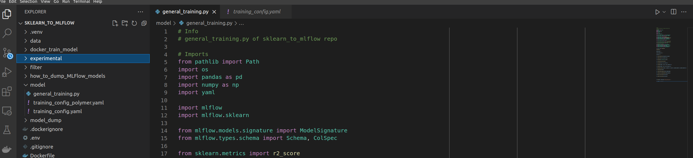

# MLFlow Part 2

## Project Repository Structure

The typical repo structure is

```bash

project
 |- data
 |- model
    |- general_training.py
    |- training_configuration.py
- Dockerfile
- poetry.lock
- poetry.toml
- pyproject.toml
....

```

The structure of "sklearn-to-mlflow" is very similar.

The `data` folder contains example data of a chemical process that can be taken for this tutorial and can be later replaced by your real data. 

The `model` folder contains `general_training.py` and `training_configuration.yaml`. 

## The model folder

The `configuration.yaml` lists the models that will be trained in one run.

Here we will train:
- Linear Regression
- Ridge Regression
- Random Forest Regression
- Decision Tree Regression
- Adaboost Regression


There are all [scikit-learn](https://scikit-learn.org/stable/#) models. The siple classes can be modified given certain parameters.
The "Adaboost Regression" model is an [ensembled](https://scikit-learn.org/stable/modules/ensemble.html) method with an inner and outer function. Both methods can be modified with parameters. Since we have and can pass more model parameters to the ensemble methods they are considered separate from the more "common" models.

```bash
# in yaml

Model:
  - "Lin_Reg"
  - "Ridge"
  - "RandomForestRegressor"
  - "DecisionTreeRegressor"

EnsembledModel:
  - AdaboostRegression:
    - "AdaBoostRegressor"
    - "DecisionTreeRegressor"

```

Within the main function in the `general_training.py` file, the models are initialized from an sklearn-models dictionary. 

```bash
# in general_training.py

sklearn_models_dict = {
    "DecisionTreeRegressor": DecisionTreeRegressor(),
    "RandomForestRegressor": RandomForestRegressor(),
    "Lin_Reg": LinearRegression(),
    "Ridge": Ridge(),
    "AdaBoostRegressor": AdaBoostRegressor()
}

```

## General Concept

### TODO: Missing picture of sklearn pipeline: Scaler + Model, 


Based on the model class, the parameters deined in the `configuration.yaml` file are taken to configure the method. For the ensemble method the inner and outer function can be configured in the `configuration.yaml` file.

```bash
# in yaml

EnsembledModel:
  - AdaboostRegression:
    - "AdaBoostRegressor"
    - "DecisionTreeRegressor"

EnsembledModel_Parameter:
  - AdaboostRegression:
    - AdaBoostRegressor: 
      - n_estimators: 130
      - learning_rate: 0.05
    - DecisionTreeRegressor:
      - max_leaf_nodes: 200
      - min_samples_split: 50

``` 

## Script Execution





[Part3](./MLFlow_part3.md)
