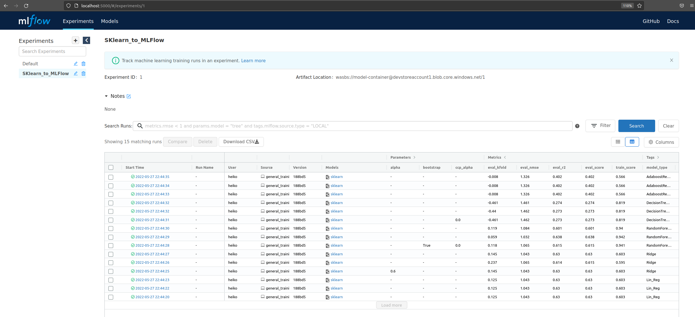
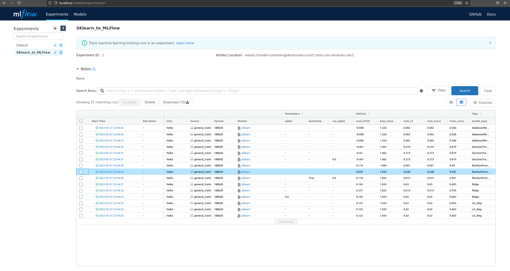
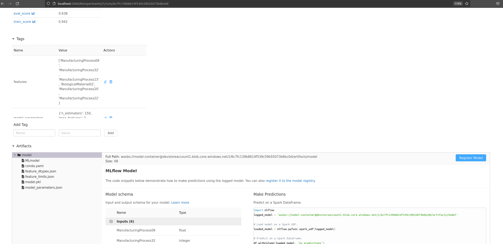
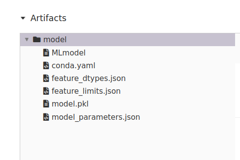
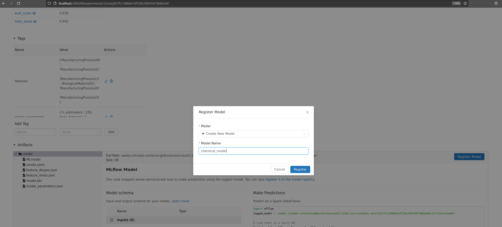
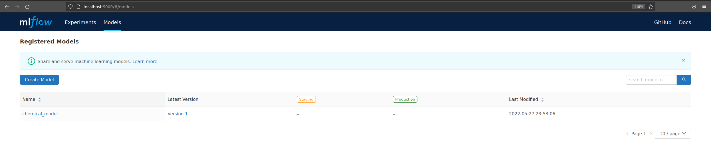
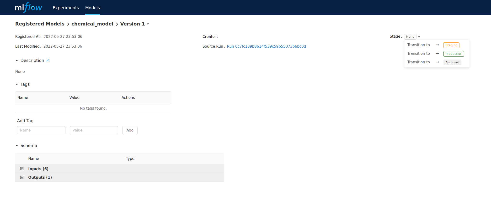
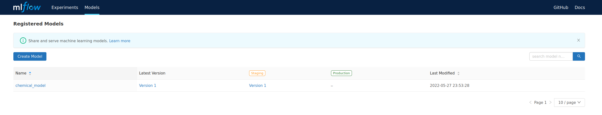

# MLFlow Part 3

## MLFlow Model Registry

When running the script either in a Pipeline (Azure or Dagster) or local execution, we create some artifacts.

We can have a look on the model training outcome and the models created on [local_mlflow](localhost:5000) and see our experiments listed for this.

Choose a model which seems to be sufficient from the metrics, select it.

When you are in an experiment, there is a button "register model" 

It is worth to also have a deeper look into the artifacts that are stored, which we have created with our "sklearn_to_mlflow.py" execution. We can create and save even more artifacts.

If we start new, there is no model name we can register the experiment to, so choose your model name. I choose "chemical_model"

Now, we have in the register card "models" our first model.

Now, we need to stage the registered experiement, to either "staging" or "production"

If we have done it, we find our first version of the model in staging or production. Try out your self.

[Part4](./MLFlow_part4.md)
