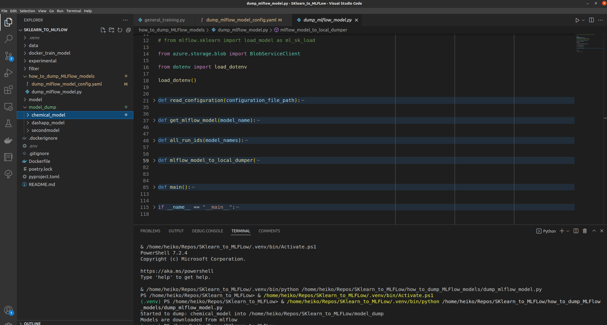

# MLFlow Part 4

## How to Interact with Models in MLflow. How to bring an Artifact in a Dash app


To only have a model in MLFlow is nice but not the complete workflow. So we know have a look into how a model can be used out of mlflow.


## Work locally

We can download a whole artifact folder (that you can se in MLflow) of a speciied model into a specified folder like `/model/`.

You can do this with Helm values in your Azure pipeline, or you can do it locally.

The `sklearn_to_mlflow` repo contains a folder with a script to dump the models that are stated in the config.yaml



The model gets dumped into a local folder, so you can work with it locally.


## Work remotely

### how to retrieve a model?

MLFlow offers two different basic fucntions to load a model from it.

```bash
# python code

import mlflow

# pyfunc
model = mlflow.pyfunc.load_model(model_uri=f"models:/{model_name}/{stage}")

# sklearn
model = mlflow.sklearn.load_model(model_uri=f"models:/{model_name}/{stage}")

```

The `pyfunc` funciton offers the possiblity to also get informaitons like `metadata` with the `run_id` that can be and is used to download the artifacts in a Dash App (which is maybe already deployed).
The `run_id` is used tor the Blobcontainer name.
Beside the access of the run_id, there are some more differences between `pyfunc.load_model` and `sklearn.load_model` lie usage of data input schema.

An easy to use function to work locally or remotely is the `get_mlflow_model` function


```bash
# python

import os
import pickle
import mlflow

def get_mlflow_model(model_name, azure=True, local_model_dir = "/model/"):

    if azure:
        azure_model_dir = os.getenv("MLFLOW_MODEL_DIRECTORY", "models:/")
        model_stage = os.getenv("MLFLOW_MODEL_STAGE", "Staging")
        artifact_path = PurePosixPath(azure_model_dir).joinpath(model_name, model_stage)
        artifact_path

        model = mlflow.pyfunc.load_model(str(artifact_path))
        print(f"Model {model_name} loaden from Azure: {artifact_path}")

    if not azure:
        model = pickle.load(open(f"{local_model_dir}/{model_name}/model.pkl", 'rb'))
        print(f"Model {model_name} loaded from local pickle file")

    return model

```

In the `sklearn_to_mlflow` repo folder `experimental` you can find all functions and their usage.


[Part4](./MLFlow_part4.md)
