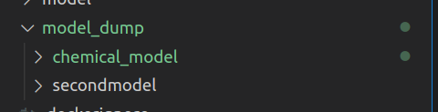

# MLFlow Part 5

# How to work with MLFlow

Now we try some experimental things that you find in [experimental](https://github.com/heiko1234/SKlearn_to_MLFLow/tree/main/experimental) within the `SKLEARN_TO_MLFLOW`. 


## Dumping a Model to a local folder

In the Repo SKLearn_to_MLFlow there is a folder `how_to_dump_MLFLOW_models` with two files in it:

- dump_mlflow_model.py
- dump_mlflow_model_config.yaml

In the `dump_mlflow_model_config.yaml` you need to change your local path. All models that are in the model_list: `sklearntomlflow` and others will be donloaded from the local MLFlow Docker container into your local folder.

Please ensure the folder is created **before** you download the model into it.

```bash
# in yaml

local_path: "/home/heiko/Repos/SKlearn_to_MLFLow/model_dump"

model_list: 
  - "chemical_model"
  # - "MFI_polymer"
  # - "CI_polymer"

```

To download the artifacts we need to execute the `dump_mlflow_model.py`. Change to the `how_to_dump_MLFlow_models` folder and execute the script.

```dash

# make sure to activate the .env to have all packages available

python dump_mlflow_model.py
```

Here you can see how the execution works.


As a result to this execution the `sklearntomlflow` folder is created with all artifacts in it. The second model is part of the `SKLearn_to_MLFlow` Repo and contains only some additional .json files.




## Feature Limit Dict

The function `create_all_model_json_dict` fetches all json files of a specificed feature from all model folders that are under a certain path. For lacal usage you can reference to the path of the Repo and with model_path to the specific folder there, while this is not needed when we ar in the remote docker, then the "path = '/model/'" and we don't need a model_path, while all models are there.

```bash
# in python

# to check all dumped models: chemical and already existing model: secondmodel
feature_limits_dict = create_all_model_json_dict(
    local=True,
    path="/home/heiko/Repos/SKlearn_to_MLFLow/model_dump",
    model_path=None,
    features="feature_limits.json")
feature_limits_dict


feature_limits_dict = create_all_model_json_dict(
    local=False,
    path=None,
    model_path=None,
    features="feature_limits.json",
    list_of_models=["MFI_polymer", "CI_polymer"]
    # or other models that you have registered, like chemical_model
    )
feature_limits_dict

```

Have a look into these feature_limits_dict. They are very nested dictionaries. For the `secondmodel`  and our fresh prepared model some of the features are double like `ManufacturingProcess20` or `ManufacturingProcess13`

```bash

{
    'chemical_model': 
    {
        'ManufacturingProcess09': {'min': 38.89, 'max': 49.36}, 
        'ManufacturingProcess32': {'min': 143.0, 'max': 173.0}, 
        'ManufacturingProcess13': {'min': 32.1, 'max': 38.6}, 
        'BiologicalMaterial02': {'min': 46.87, 'max': 64.75}, 
        'ManufacturingProcess20': {'min': 0.0, 'max': 4759.0}, 
        'ManufacturingProcess22': {'min': 0.0, 'max': 12.0}, 
        'Yield': {'min': 35.25, 'max': 46.34}
    }, 
    
    'secondmodel': 
    {
        'ManufacturingProcess13': {'min': 32.1, 'max': 38.6}, 
        'ManufacturingProcess20': {'min': 32.1, 'max': 38.6}, 
        'ManufacturingProcess32': {'min': 150.0, 'max': 170.0}, 
        'ManufacturingProcess42': {'min': 130.0, 'max': 190.0}
        }
    }


```

There are two functions in this python file:

- flatten_dict()
- flatten_consolidate_dict()

The flatten_consolidate_dict() function has some parameters like `take_lower_min=True` or `take_higher_max=True`.

```bash
# in python

flat_featue_limits_dict= flatten_dict(nested_dict=feature_limits_dict)
flat_featue_limits_dict


flatten_consolidate_dict(nested_dict = feature_limits_dict, take_lower_min=True, take_higher_max=True)

flatten_consolidate_dict(nested_dict = feature_limits_dict, take_lower_min=True, take_higher_max=False)

```

Play around and see what you get in each case.


Now, we would like to create a warning message (with the function `create_warning`) that give a dcc.Markdown that can be later implemented into a Dashapp) based on an value input and the consolidated dictionary.

```bash
#in python

TAG_limit_dict = flatten_consolidate_dict(nested_dict = feature_limits_dict, take_lower_min=True, take_higher_max=True)
# have a look on the dictionary
TAG_limit_dict

create_warning(TAG_limit_dict=TAG_limit_dict, key = "ManufacturingProcess42", value=200) #yes
create_warning(TAG_limit_dict=TAG_limit_dict, key = "ManufacturingProcess42", value=160) #no
create_warning(TAG_limit_dict=TAG_limit_dict, key = "ManufacturingProcess42", value=120) #yes

```


## Feature dtype Dict

OK, let's go on.

Very similar to the function before we are going to collect all json files with the naming `feature_dtypes.json` and use the function `flatten_dict()`. 
We will create very easily a simple dictionary: 

```bash
# in python

get_model_json_artifact(
    azure=False,
    path="/home/heiko/Repos/SKlearn_to_MLFLow/model_dump",
    model_name="chemical_model",
    features="feature_dtypes.json",
)


feature_dtypes_dict = create_all_model_json_dict(
    local=True,
    path="/home/heiko/Repos/SKlearn_to_MLFLow/model_dump",
    features="feature_dtypes.json")
feature_dtypes_dict


dtype_dict=flatten_dict(nested_dict=feature_dtypes_dict)
dtype_dict


{
    'ManufacturingProcess09': 'float', 
    'ManufacturingProcess32': 'integer', 
    'ManufacturingProcess13': 'float', 
    'BiologicalMaterial02': 'float', 
    'ManufacturingProcess20': 'integer', 
    'ManufacturingProcess22': 'float', 
    'ManufacturingProcess42': 'float'
    }

```

I guess it helps to understand that python nd mlflow have different kind of data types. When we created a mlflow model these data types can be stored in the schema in the model.
Depending on the function to load the model from mlflow either 
`mlflow.pyfunc.load_model()` or `mlflow.sklearn.load_model()` or even the simple pickle file usage if the model is dumped.

I included in a decode function the mlflow_dtypes, so that we can use this function to translate our inputs into a model to mlflow meaningful data types.

```dash

# in the decode_df_mlflow_dtype function
def decode_df_mlflow_dtype(data, dtype_dict):

    mlflow_dtypes = {
        "float": "float32",
        "integer": "int32",
        "boolean": "bool",
        "double": "double",
        "string": "object",
        "binary": "binary",
    }

```

## Generic Kusto Query
Based on the `dtype_dict` file that we have created it is very easy to create a generic kusto query if needed.

```dash

TAG_list = list(dtype_dict.keys())
TAG_list

```
This list can be used for data load functions and SQL or Kusto queries. 


## Prepare some data

We are going to prepare some data to test and check the behavior of our MLFlow models.


```bash

MP09 = 40  #38.89..49.36
MP32 = 160  #150..170
MP13 = 36 # 32.1..38.6
BM02 = 60  # 51.28..64.75
MP20 = 4600  # 4392..4759
MP22 = 6  # 1..12
MP42 = 140  #130..190 (secondmodel feature_limits.json)

```

We create 3 different data frames 

```dash

data = pd.DataFrame(
    data=[[MP09, MP32, MP13, BM02, MP20, MP22]],
    columns=[
        "ManufacturingProcess09",
        "ManufacturingProcess32",
        "ManufacturingProcess13",
        "BiologicalMaterial02",
        "ManufacturingProcess20",
        "ManufacturingProcess22",
    ],
)
data
data.dtypes

# same parameter but different order
data2 = pd.DataFrame(
    data=[[MP09, MP13, MP32, MP20, MP22, BM02]],
    columns=[
        "ManufacturingProcess09",
        "ManufacturingProcess13",
        "ManufacturingProcess32",
        "ManufacturingProcess20",
        "ManufacturingProcess22",
        "BiologicalMaterial02",
    ],
)
data2

# one extra parameter
data3 = pd.DataFrame(
    data=[[MP09, MP32, MP13, MP42, BM02, MP20, MP22]],
    columns=[
        "ManufacturingProcess09",
        "ManufacturingProcess32",
        "ManufacturingProcess13",
        "ManufacturingProcess42",
        "BiologicalMaterial02",
        "ManufacturingProcess20",
        "ManufacturingProcess22",
    ],
)
data3

```

and we change the data types of these pd.DataFrames:

```bash

# Change data dtypes

data = decode_df_mlflow_dtype(data = data, dtype_dict=dtype_dict)
data2 = decode_df_mlflow_dtype(data = data2, dtype_dict=dtype_dict)
data3 = decode_df_mlflow_dtype(data = data3, dtype_dict=dtype_dict)

```


## Model Predictions

Now, we can load our `sklearntomlflow` model from either the dumped pickle file or with the `mlflow.pyfunc.load_model` wrapped funciton that can connect to either our local dockerized MLFlow model or to your cloud stored MLFlow.


```bash

# Load a MLFlow Model either from local artifact or from MLFlow Docker container

# local pickle file
model= get_mlflow_model(model_name="chemical_model", azure=False, local_model_dir = "./model_dump")

model.predict(data)  #39.0
model.predict(data2) #38.9
model.predict(data3)  # error: 7 features instead 6


# azure mlflow.pyfunc.load_model()
model= get_mlflow_model(model_name="chemical_model", azure=True, local_model_dir = None)

model.predict(data)  #39.1
model.predict(data2)  #39.1
model.predict(data3)  #39.1

```

As we can see, the load with the pyfunc.load_model() methode has some extra advantages, like permutation of feature columns and also extra parameters in the data frame does not have an effect on the model prediction while this is not true if we use the dumped pickle file of the model.
To use the dumped pickle file our input features need to be in the correct order, and only then it seem to work while using mlflow.pyfunc.load_model does this work for us.


# Conclusion

Ok, we are done!

This tutorial should give you the opportunity to develop locally your models and develop your own dash app in wiede ranges locally with all tools that you may have on your plattform available. 

I hope I have catched most cases how we could use mlflow efficiently and adopped it into the provided `SKlearn_to_MLFlow` repo.

