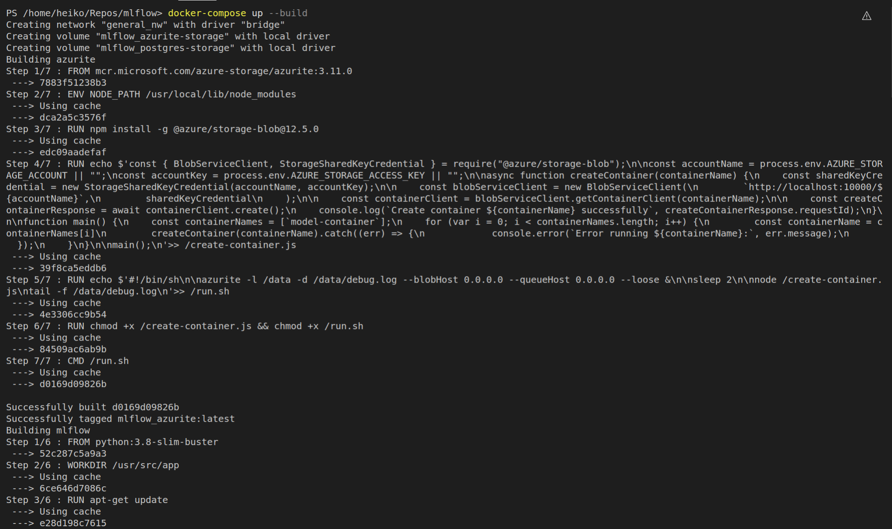
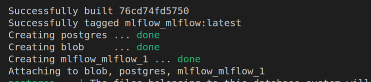
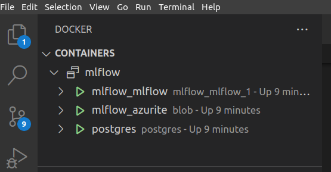

# Getting Started

In this tutorial I will provide an introduction on how to use mlflow loally and show some further useage of mlflow.


## Repositories that we will work with

We will work with 2 repos for this tutorial. 

- [mlflow](https://github.com/heiko1234/mlflow)
- [sklearn_to_mlflow](https://github.com/heiko1234/SKlearn_to_MLFLow)

Please, remember to to have Docker on your computer.

## Setting up local MLFlow

Go to the folder of "mlflow", start Docker and run

```bash
docker-compose up --build
```

to create the MLFlow docker container.




When everything is correct all docker container show a "done"



The working container show up also in your vscode



### How to Stop MLFLOW

To stop MLFlow use

```bash

docker-compose down -v

```

Just to remember.


## Project configuration via "env" file

To ensure we are writting our modles to our local mlflow container we need to configure a ".env" file as follows:

```bash

# Azure Connection String for local Blob
AZURE_STORAGE_CONNECTION_STRING="DefaultEndpointsProtocol=http;AccountName=devstoreaccount1;AccountKey=Eby8vdM02xNOcqFlqUwJPLlmEtlCDXJ1OUzFT50uSRZ6IFsuFq2UVErCz4I6tq/K1SZFPTOtr/KBHBeksoGMGw==;BlobEndpoint=http://localhost:10000/devstoreaccount1;QueueEndpoint=http://localhost:10001/devstoreaccount1"

# MLFLOW URI
MLFLOW_TRACKING_URI="http://localhost:5000"

# Run it locally or Remote
LOCAL_RUN = True

```

Create the ".env" file in the root folder of "SKLearn_to_MLFlow" or other project folder.


[Part2](./MLFlow_part2.md)