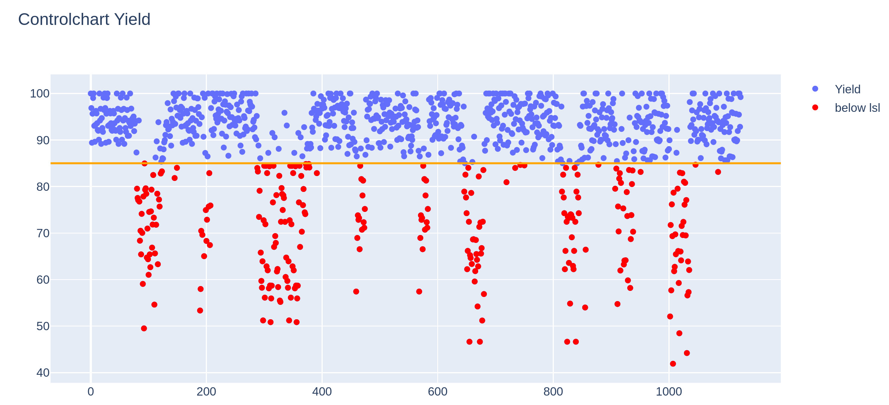

# Szenario Polymer Improvement

You work as Data Scientist in a chemical compony that produces white plastic granulate and supplies it to a molding plant, where it is made into white plastic die castings.

However, the molding proess goes through intermittent phases when its product quality drops, leading to yield losses at both the polymer and the molding plant.

When a crisis occurs, teams are formed to tackle the problem, but the problem usually disappears for no apparent reasons.

**You** are selected to solve another mysterious crisis. 

**You** and your small proect team decided to concentrate on two characterists (Ys) that are of special importance:

- **MFI**: melt flow index
- **CI**: color index

## What are we going to learn?

We will go through the odyssey of this project, with its highs and lows step by step.

We will have a look into the cost savings of the project.

## Szenario Details

All effots to find the root cause of low yields in both plants have been failed so far. Now, a new crises happens and need a fast solution.

### Manufacturing Process

Producing white plastic die castings is not easy and needs the right balance of whiteness and flow. As the ratio of additives in the mixing process is increased to mke the plastic granulate white, the flow of the plastic is impaired (decreased).

The process can be devided into 3 steps:

- Filler preparation
- Polymerization
- Granulation + Packaging

### Filler preparation

A white filler, which is an inert powder. It is mixed with unpurified river water in a stirred tank. 
The filler preparation tank is steady mixed and held at target concentration.
The content gets refilled / appendixed each day with filler and water, as well as small amounts of a ciscosity modifier if the iscosity gets to high.

### Polymerization

The polymierization process is a batch process, while the plant is running 24h every day with 3 batches a day.
Clear polymere can be done by heating and stirring a monomer until it polymerizes. The white polymer is created by adding filler slurry to the reaction start into the polymerization reaction vessel.

### Granulation of Polymer
When the polymerization reaction is complete, the molten polymer is granulated and packed.

### Analytics

The process is very well quality controlled. For each batch of polymer a sample is taken and tested:

- **color** (whiteness), CI
- **MFI**, the MFI is offline measured and will indicate how well the polymer will be processed in the down-stream plant
- **filler content** of the polymer

## Project Team

You have contact to:

- polymer plant quality manager
- polymer technical support chemist
- process engineer at the down-stream plant

## Crisis

Crisis happens regularly and the sequence of this events are very similar.

1. Normal Operation for several month without any problems
2. Recognize a problem with flowability
3. Checking down-stream process parameteres
4. Checking quality of the starting polymer, which is in specification
5. Checking testing equipment
6. Assume that down-stream process has changed
7. After a few days of bad production, ask for different polymer as trail run
8. Fresh restart of down-stream process (molding plant): 
    - empty polymer silos
    - purged material is sold as scrap, with a low price and lowers the yield
    - output of down-stream process far behind schedule and customers ask for compensations.

### Theories

- the filler supplier is inconsistent and should be replaced
- the filler is not well distributed through the polymer and agglomerates are blocking the flow channels in the molds
- Heavy rain has an effect on the pH of the water supply, which will affect the polymerization reaction
- MFI specification is to high, so batches of polymer at the bottom end of the specification range should be the only one used
- abnormal ambient temperatures and humidity are blamed to have a negative effect to the polymer

Process changes are made, trials are run and data are gathered. But none of the changes ever conclusively solve the problem. 
The problem goes away and each project team so far improved the process gradually and convinced that their solution was making the difference until the next crisis.

## Framing the Problem

Although there is a polymer specification, it is assumed that this does not fully reflect the true requirements.

After a few discussions, these KPIs are selected to concentrate on:

- MFI: melt flow index
- CI: color index
- Yield: good polymer / total polymer
    - good polymer: successfully processed by the down-stream plant
    - total polymer: sum of polymer

### Historical Data

The project team collects historical data on daily yield. 
The Data contain `Date` and `Yield` and can be found [here](./data/BaselineYieldData.csv).

We have a short check on the data using `numpy`, `pandas` and `plotly`. 
You can have a look on the [baseline_analysis.py](./source/baseline_analysis.py).

Create a chart that clearly shows the periods of high yields. 

The average Yield over the time period is about 88 % but filtering the values that are below 85.0% result in a average Yield of 94 %.

## Next steps

Now, we can continue with the next phase of the project.
Please open [part2]

[Part2](./Readme_Polymer_part2.md)
