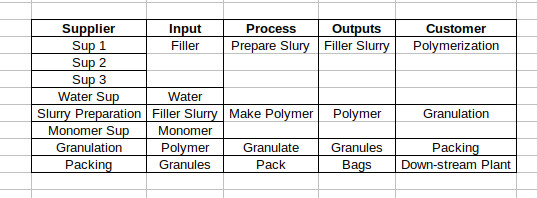
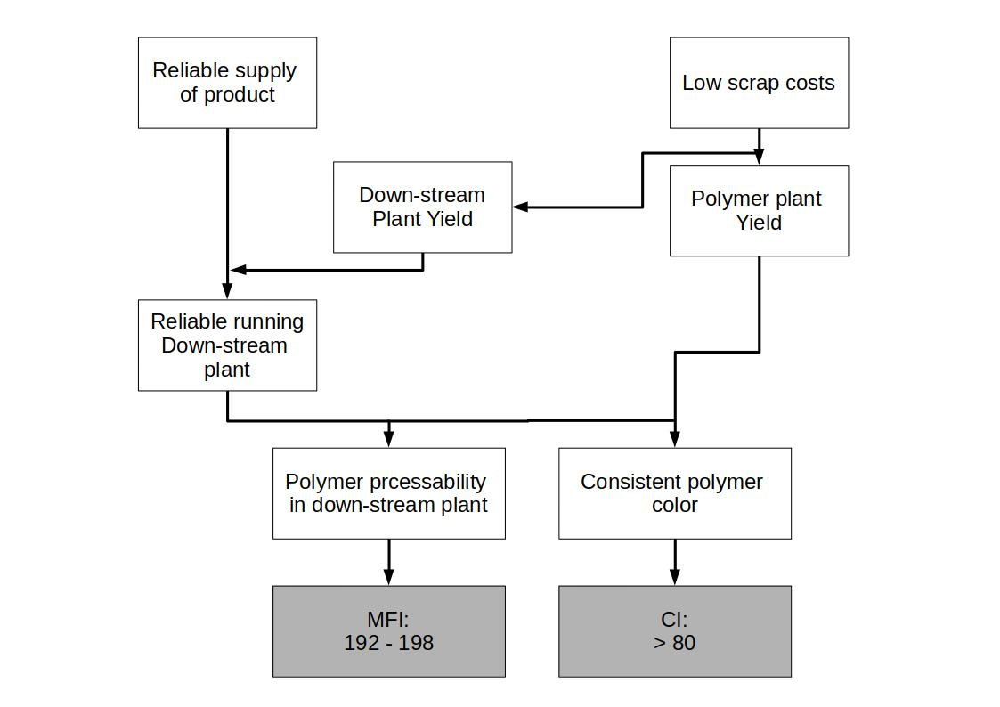
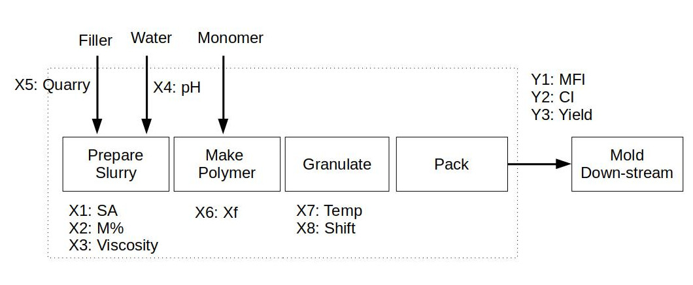

# Polymer Improvement Part 2

## Next steps

After you checked the Yield, you decide to concentrate on the polymer plant and set a goal for this Trouble shooting task.

You know that if you eliminate the crises, a 94 % average yield is achivable while you believe you can do better 95 % is your personal target.

### Goal: **Yield up to 94 %**

To understand the process a bit better you do a small SIPOC and a VOC of the process.

## SIPOC

## VOC (Voice of the customer)

You decide to draw a *Critical to Quality Tree* to tacke the critical customer needs and their drivers to finally go to the measurabe requirements that are needed for improvements.

### Down-stream plan requirements:

- MFI between 192 - 198 (target: 195)
- maximum possible CI value is 100, but CI must exceed a lower specification limit of 80

## Historical Data of former Crisis Teams

Earlier Teams were unable to identify the root cause of the crisis. 

You and your Team begin to review the last crisis team's data and analysis. You find an *Input/Output process map* (similar to a flow chart or an simple PID charts). The former TEAM already labeld 3Ys and 8Xs of special interest.

You find a table with these information under [Link](./polymer_process_improvement/data/CrisisTeamData.csv). 
There is no explicit time column, only the *Batch number* define the process order.

Please find [here](./polymer_process_improvement/source/crisisTeamData_analysis.py) the python file for making some graphics.

Of particular interest are those values that have a *Yield* smaller than 85 %, which can be done with plotly express and a small filter very easily.

Since CI has a natural upper bond at 100 %, the shape of this curve is not bell-shaped or normal distributed.

## Some more History

The former crisis Team analyzed the data using multiple regressions. The crisis team hoped to determine which Xs had a significant effect on the three key responces. M% and Viscosity are signiicanlty related to MFI, while any of Xs to be related to CI.

There are several reasons why such an analysis might lead to no significant factors:

- One or more key Xs are missing
- One or more higher-order terms involving the specified Xs are missing
- Measurement variations in the Ys or s is too large and is masking the systematic patterns in the Ys caused by process variations in the Xs.

After reaching out a former crisis Team member, that onvinced you that all significant Xs are in the dataframe, you decide to work with higher higher-order terms.
This uncovers some significant relationships, but they don't seem conclusive in terms of the process, especially as they relate to CI. 

At this point, you have the suspicion that measurement variations may be clouding the results.

You talk to your Team and you decide to have a deeper look into systematic variations in Xs.

[Part3](./Readme_Polymer_part3.md)

