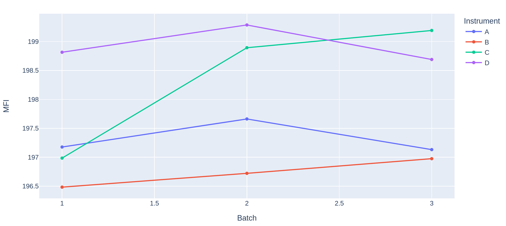
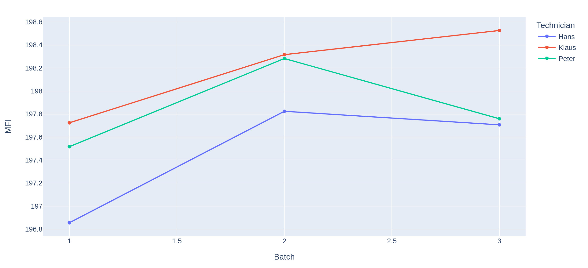

# Polymer Improvement Part 3

## MSA

### General Measurement systems for Key Variables should **always** be evaluated before engaging data collection efforts.

Since previous attemps seem to failed to find the root cause of the polymer problem because of measurement uncertainties, it is more important to study the measurement systems for all variables identified in the process flow map.

## MSA Overview of Measurements

- *Temperature* is measured via T100 sensor, that is calibrated every year without any meaningful errors or sensor shifts recorded so far.
- *Viscosity* is measured in the laboratory with a viscositmeter.
- *pH* is measured with an always calibrated pH-Meter
- *CI* is measured with a calibrated APHA color measurement system, calibrated with standards
- *M%* (mass concentration of viscosity modifier in slurry) is measured by measureing the weights of each component and calculating the ratio
-  *SA* (electrical amperage power for stirrer at slurry tank) is measured with galvanometer

However, the measurement systems for *MFI* and *Xf* are not evaluated for a long time.


## MSA for MFI

The MFI is measured with a melt flow meter in an offline laboratory test.  
- 4 instruments are available to do this test.
- 3 different laboratory technicicals can run this test
- No formal calibration is done for the instruments
- You have the impression that there is no common, standard procedure to run the test

Having a deeper look into the MFI measurement, thats limits are 198 and 192, 10 % of tolerance range for this measurement is 0.10 x (198 - 192) = 0.6 MFI units.
A highly capable measurment system should not exceed 10 percent of the part-to-part (or batch-to-batch) variablity.

### Facts about the MFI measurement:

- destructive
- 1 test run over 30 min
- 3 measurements are taken on each sample at prescribed times
- laboratory technicicals are not always available at these times
- 3 values get averaged
- from preparation to finish a test usually takes 45 min to run

Although the test is dstructive and a true repatability is not possible, a well mixed sample from a batch divided into smaller samples could be considered as identical.

Calculating the needed tests:

3 batches x 3 lab technicians x 4 instruments x 2 measurements of each sample = 72 tests

Since a test is destructive a sample from a given batch of polymer needs to be divided into 24 aliquots for testing. 
To run 3 tests per hour using 3 of 4 instruments lead to an estimation of 24 hours for the MSA, which could be handled with in 5 working days


## DOE Design for MFI

### You design a simple DOE experiment plan, that you can find [here](./polymer_process_improvement/source/DOE.py) and give it to the technicans and lab leaders to do the experiments for you.  

The DOE experimental plan is randomized and you stress the technicans that it is important of running these experiments in this order. The technicans accept and do the them over the next week and enter their results into the data table.


The average of the 3 batches once for each instrument and once for each technician is created.





It seems to haave an interaction between Instrument and Batch.The instruments sem to sho a difference cross the batches. Instrument C seem to give higher values for Batch 2 and 3 than expectd on the first measurement.

The technician plot suggest that *Klaus* s measurements hve higher MFI values thn *Hans*. So, there is a diffence of more than 0.5 MFI units.


[Here](https://sixsigmastudyguide.com/repeatability-and-reproducibility-rr/) you find some informations about the Theory behind Six Sigma Gage R&R.


To interprete these data we will use an gage r&r (six sigma approach): 

```bash
                                repeatabilit
                                |
                    gage r & r--|               operator
                    |           |               |
total variability --|           reproduibility--|
                    |                           |
                    part-to-part                interaction

```

When using the [Gage_RnR](./source/Gage_RandR.py) we can generate the graphics but also this table: 

```bash

                    names  variations  percent of total
0                Gage R&R    2.697313            89.199
1           Repeatability    0.921968            30.489
2         Reproducibility    1.775345            58.710
3   Interaction Variation    0.189567             6.269
4  part-to-part Variation    0.137052             4.532
5         Total Variation    3.023932           100.000

```

**Repeatablity**: Repeated easurements of the same part by the same operator with the same instruments

**Reproducibility**: Repeated measurements of the same part by different operators using different instruments

**part-to-part Variation**: Differences in the parts used in the MSA: here parts are represented by batches

**Interaction Variation**: Differences due to the interaction components. Here the interaction components are *Operator x Instrument*, *Operator x Batch* and *Instrument x Batch*.

It can be seen that the Gage R&R component is very large compared to the product variation (part-to-part) variance. This suggests that the measurement system has difficuty distinguishing batches.
A control chart monitoring this process is mainly monitoring measurement variation. 

The *Batch* variation accounts only for only ca. 4% of the total variation.

Recalling that the measurement system range, measured as six standard deviations should take up at most 10 % of the tolerance range, which is 10 % x (198 - 192) = 0.6 MFI units.

The standard deviation of the measurement system is about 1.34 x 6 = 8.06 MFI units which is much higher than the expected 0.6 MFI units.


