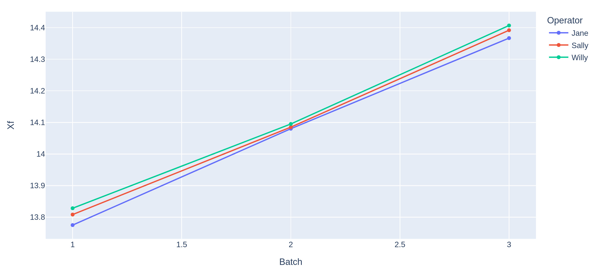

# Polymer Improvement Part 4

## MSA Findings

In summary the gage R&R of *Xf* and *MFI* indicates that the measurement systems are in trouble and need to be refined.

The optimization of the measurement system will dramaticly extend the project timeline but without it the results are meaningless.

Furthermore, based on the results of the MSAs the historical data obtained so far by other crisis teams are useless.

You decide that new data are neccessary which will delay the project even more.

## New timeline

To optimize the measurement system in the laboratories will take minimum 6 weeks. 

To collect enough new data with the new quality measurements will also take minimum 6 weeks. 

You suggest a total project delay of minimum 3 month.


# Measurement Improvements

## MFI

The 4 MFI measurement melt flow meter are of different suppliers and they seem to have a different unit printed on them. So, all 4 melt flow meters were replaced with new and are callibrated on regular basis with a standard.


## Xf

Two major improvements have been made:
- The oven control was improved, so that the target temperature is well controlled
- The scales are replaced by highprecision digital scales.


## Repeating the MSA of Xf 

Repeating the MSA after the process has been changed, the [Code](./source/Gage_RandR_part2.py) can be executed and will give these nice plots for the MSA.

Xf for each Operator overlayed.


and Xf for each Instrument.


The gage R&R shows a high significance on the part-to-part variance, showing that the improvements were very successful.

```bash

                    names  variations  percent of total
0                Gage R&R    0.004371             4.854
1           Repeatability    0.000958             1.064
2         Reproducibility    0.003413             3.790
3   Interaction Variation    0.000324             0.359
4  part-to-part Variation    0.085352            94.787
5         Total Variation    0.090046           100.000

```


## Repeating the MSA of MFI 

Repeating the MSA after the process has been changed, the [Code](./source/Gage_RandR_part2.py) can be executed and will give these nice plots for the MSA.

MFI for each Operator overlayed.


and MFI for each Instrument.


The gage R&R shows a high significance on the part-to-part variance, showing that the improvements were very successful.

```bash

                    names  variations  percent of total
0                Gage R&R    0.027158             1.134
1           Repeatability    0.011492             0.480
2         Reproducibility    0.015666             0.654
3   Interaction Variation    0.005177             0.216
4  part-to-part Variation    2.363243            98.650
5         Total Variation    2.395578           100.000

```

