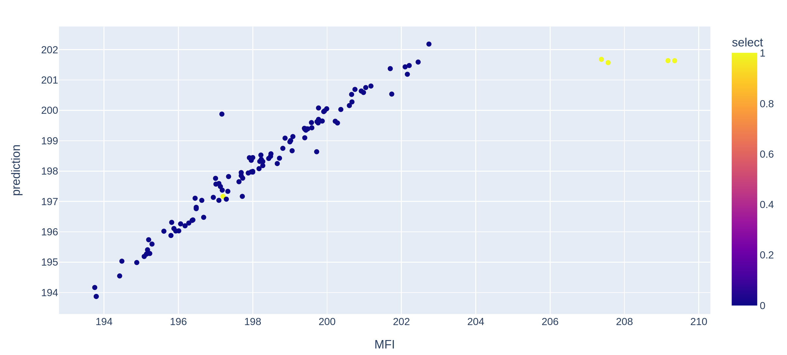

# Polymer Improvement Part 5

## Working with New Data


With new and reliable measurement systems in place the project can be continued. New data gets collected.

[Here](./data/CrisisTeamData.csv) are the data.

You are a data scientist of your own. 

Create and play with these data to create a model for:

- MFI
- CI

You can create, test and run models of your own to make good suggestions for these targets.


## Advanced Modelling

Beside your attempts to model, we like to use the sklearn_to_mlflow repo.

Change the training yaml file.

```bash

data_load: "/home/heiko/Repos/data_science_tutorials/polymer_process_improvement/data/VSSTeamData.parquet"

target:  "MFI" 

features:
  - "M%"
  - "Xf"
  - "SA"
  - "SASA"
  - "SASASA"
  - "XfXf"

```
and for target CI

```bash

data_load: "/home/heiko/Repos/data_science_tutorials/polymer_process_improvement/data/VSSTeamData.parquet"

target:  "CI" 

features:

  - "Xf"
  - "XfXf"
  - "XfXfXf"

```

As you see, we only need to change the yaml file for the training in that pipeline. 

We execute the `general_training.py` in its Repo folder, since this virtual environemnt is also good for the training of our project.


Choose on one model with good performance and `register` and also `stage` it, so we can download it later on.


We can register these models like:

- MFI_polymer
- CI_polymer


Since we have trained these models, we also want to make predictions.

We can load the models with the `get_mlflow_model` function direct from mlflow.

```bash


MFI_model = get_mlflow_model(model_name="MFI_polymer", azure=True, model_dir=None)

CI_model = get_mlflow_model(model_name="CI_polymer", azure=True, model_dir=None)

```

Since MLFlow saves the inputs in its own format, we bring our data frame for the prediction to float32 format.

```bash

for cname in data.columns:
    try:
        data[cname] = data[cname].astype("float32")
    except BaseException:
        continue

data

data["prediction"] = MFI_model.predict(data)

data["diff"] = data["MFI"] - data["prediction"]

```

We use the whole not filtered ( Filter: Yield >= 55.0 %), since we have ower label, we see that these few data points with a different special cause (Yield far away from normal operations) would destroy ower new nice model and its performance.




## Different Directions

### Single Target Optimizer

Wau, we have a model that makes good predictin at least for MFI (CI we do later). 

Now, we like to get a set of optimal inputs for our target output, MFI. 

Our Target requirements from the project start [Readme_part2](./Readme_Polymer_part2.md)

- MFI between 192 - 198 (target: 195)
- maximum possible CI value is 100, but CI must exceed a lower specification limit of 80


We like to use the model to make a suggestion for setpoint on:
- "M%"
- "Xf"
- "SA"


We use and modify a [genetic](https://machinelearningmastery.com/simple-genetic-algorithm-from-scratch-in-python/) optimizer and create a loss function for our problem. The loss function contains the MFI model.

```bash

from polymer_process_improvement.source.setpoint_suggestion_genopt import (genetic_algorithm)


bounds = create_bounds_list(create_df_testing_cnames, bounds_dict)

target = 196

def loss_MFI_function(target, X):
    model = MFI_model
    M_per = X[0]
    Xf = X[1]
    SA = X[2]
    idata = create_df_testing(M_per, Xf, SA)
    modeloutput = model.predict(idata)
    diff = abs(target - modeloutput)
    return diff


new_setpoints = genetic_algorithm(
    objective=loss_MFI_function,
    target=target,
    bounds=bounds,
    break_accuracy=0.005,
    n_bits=16,
    n_iter=100,
    n_pop=100,
    r_cross=0.9,
    r_mut=None,
)
new_setpoints


MFI_model.predict(create_df_testing(M_per=new_setpoints[0], Xf=new_setpoints[1], SA=new_setpoints[2]))[0]


>>> new_setpoints
[1.23629, 18.3108, 58.43259]

```

I guess this is already cool to give for a specific target suggested better setpoints.


### Multi Target Optimization

To have both models for MFI and CI in the loss function makes it a multi target optimization.

The target needs to be extended with a target for CI. 

And thats it. Give these small changes to the genetic optimizer and the result will be [1.614, 17.87, 65.15] for M%, Xf, SA.


```bash

target = [196, 90]

def loss_MFI_function(target, X):

    M_per = X[0]
    Xf = X[1]
    SA = X[2]
    idata = create_df_testing(M_per, Xf, SA)
    modeloutput_MFI = MFI_model.predict(idata)
    modeloutput_CI = CI_model.predict(idata)

    diff = abs(target[0] - modeloutput_MFI)
    diff2 = abs(target[1] - modeloutput_CI)
    return 2*diff+diff2


```

[Part6](./Readme_Polymer_part6.md)
