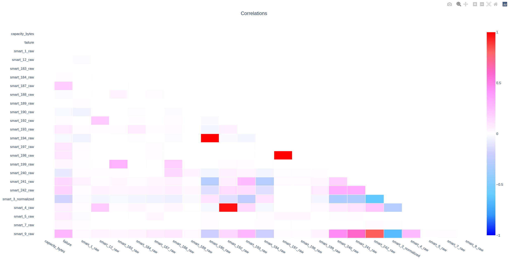
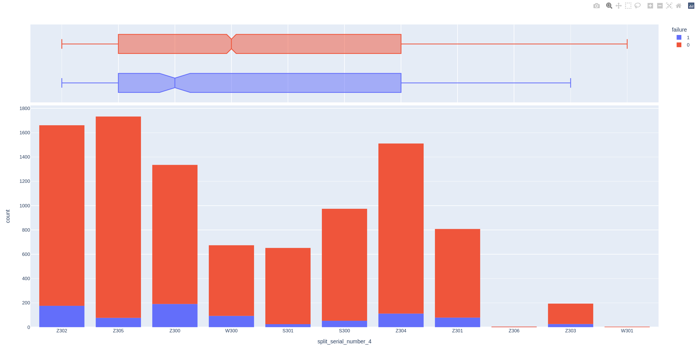
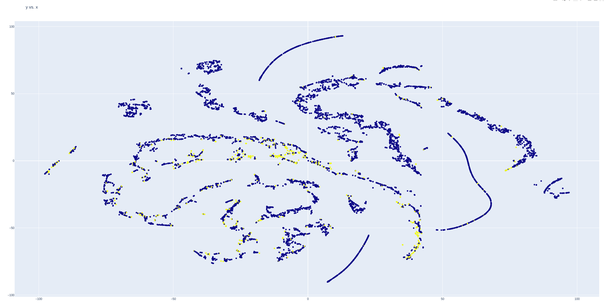
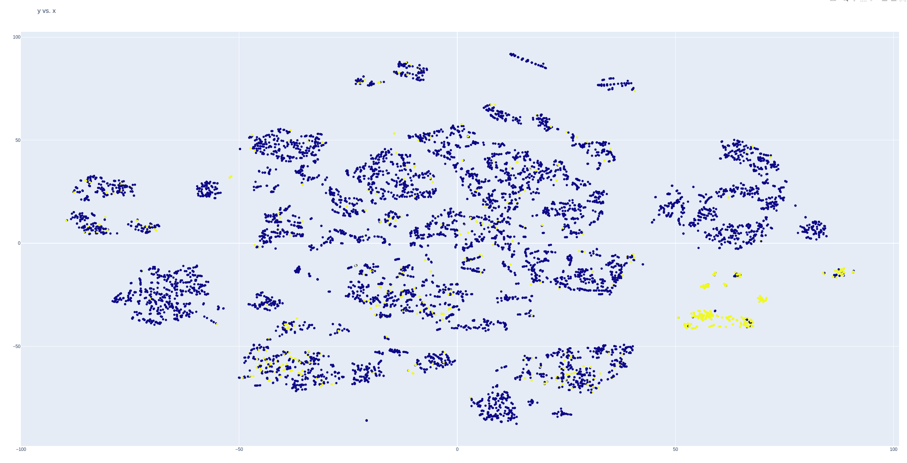

# Predictive Maintenance

Ok, let's start with loading the data.

We load the dataframe `df_2016_7.csv` and have a look on the names of the columns

```bash


import numpy as np
import pandas as pd


import plotly.express as px


# 7 days in advanced
df = pd.read_csv("./predictive_maintenance_hd/data/df_2016_7.csv")


cnames=list(df.columns)
cnames

#['capacity_bytes', 'date', 'failure', 'model', 'serial_number', 'smart_1_raw', 'smart_12_raw', 'smart_183_raw', 'smart_184_raw', #'smart_187_raw', 'smart_188_raw', 'smart_189_raw', 'smart_190_raw', 'smart_192_raw', 'smart_193_raw', 'smart_194_raw', 'smart_197_raw', #'smart_198_raw', 'smart_199_raw', 'smart_240_raw', 'smart_241_raw', 'smart_242_raw', 'smart_3_normalized', 'smart_4_raw', 'smart_5_raw', #'smart_7_raw', 'smart_9_raw']

``` 


We start loading some extra functions to analyse and make some plots.


```bash

from predictive_maintenance_hd.source.data_utility import (
    split_target_and_feature,
    reset_index_train_test_split,
    scale_data,
    Encoder2DataFrame,
    remove_columns,
    check_variance
)

from predictive_maintenance_hd.source.graphics import (
    make_TSNE_plot,
    paretoplot,
    correlationplot
)


```


We check on the serial numbers and se that there are common patterns like the 4 first digits are repeating sometimes. It could be a good idea to splitt these things and use it as features.


```bash

df["serial_number"]

# df["serial_number"]
# 0       Z30252GX
# 1       S301L9WM
# 2       Z305GV9E
# 3       Z3052GQF

# Feature Engineering

df["split_serial_number_3"] = df["serial_number"].str[:3]
df["split_serial_number_4"] = df["serial_number"].str[:4]
df["split_serial_number_1"] = df["serial_number"].str[:1]


# making some plots

# colorscale=px.colors.sequential.Bluered
# colorscale=px.colors.diverging.Picnic

correlationplot(data=df, 
    colorscale=None, 
    title="Correlations", 
    hoferinfo=True, 
    digits=3, 
    annotation=False, 
    plot=True)


```



We see some nice correlations.

Lets have a look on the histograms. We create a for loop to make for each feature a histogram to decide if we need some kind of transformation for the modelling.

```bash

for c_element in list(df.columns):
    fig = px.histogram(df, x=c_element)
    fig.show()


# an individual plot
fig =  px.histogram(data_frame=df, x="split_serial_number_4", color = "failure", nbins=100, marginal="box")
fig.show()


```

As we see from the histogram for `split_serial_number_4` feature that we have created that not all serial numbers are equally distributed.




Ok, now let's encode the serial number digits with the OneHotEncoding and the function around it (`Encode2DataFrame`) that give a dataframe and the encoder back.


```bash

# serial_number encoding
list(df.columns)

cnames_serial = [i for i in df.columns if "serial" in i]
cnames_serial


dd_extra1, ohe1 = Encoder2DataFrame(data=df, column_name="split_serial_number_1")
dd_extra1.head()


dd_extra3, ohe3 = Encoder2DataFrame(data=df, column_name="split_serial_number_3")
dd_extra3.head()

dd_extra4, ohe4 = Encoder2DataFrame(data=df, column_name="split_serial_number_4")
dd_extra4.head()


# dd_extra4.head()
#      S    W    Z
# 0  0.0  0.0  1.0
# 1  1.0  0.0  0.0
# 2  0.0  0.0  1.0
# 3  0.0  0.0  1.0
# 4  0.0  0.0  1.0


# append the data
# new df

df = pd.concat([df, dd_extra1, dd_extra3, dd_extra4], axis=1)
df


```


We clean up some data columns. The encoded data columns get removed and also some columns that are not numbers or don't show variance.

```bash

# remove  

list_of_columns_to_drop = ["date", "model", "capacity_bytes"]

list_of_columns_to_drop = ['serial_number', 'split_serial_number_3', 'split_serial_number_4', 'split_serial_number_1']

df = remove_columns(data=df, list_columns_to_remove=list_of_columns_to_drop)


df.head()

```


Ok, the data prepared so far. we splitt them in test and training data and make a t-sne plot

```bash

# Split date in feature and target data

data_target, data_features, target_name, feature_names = split_target_and_feature(data=df, target="failure")

# split features and target data in train and test datasets

features_train, features_test, target_train, target_test = reset_index_train_test_split(
    feature_data=data_features, 
    target_data=data_target, 
    test_size=0.2, 
    random_state=2022
    )

list(features_train.columns)

#t-sne

make_TSNE_plot(
    features=features_train, 
    target=target_train, 
    plot=True)

```

In the tsne plot we see not a clear separation of failure and healthy HD data.




Let's try some scaler, to see if we can increase the performance.
Chosse one of the scaler and repeat the tsne plot

```bash


# Data Preprocessing

from sklearn.preprocessing import (
    PowerTransformer,
    QuantileTransformer,
    StandardScaler,
    MinMaxScaler,
)


# Transformer

MinMax_transformer = MinMaxScaler(feature_range=(0, 1))

train_np, test_np, scaler = scale_data(train=features_train, test=features_test, scaler=MinMax_transformer)


# Transformer

MinMax_transformer = StandardScaler(with_mean=True, with_std=True)

train_np, test_np, scaler = scale_data(train=features_train, test=features_test, scaler=MinMax_transformer)


# Transformer
quantile_transformer = QuantileTransformer(random_state=0)

train_np, test_np, scaler = scale_data(train=features_train, test=features_test, scaler=quantile_transformer)


# Transformer


# Transformer   box-cox
powertransformer=PowerTransformer(method='box-cox', standardize=True)

def add_const(data, value=1):
    for ccol in data.columns:
        data[ccol] = data[ccol]+value
    return data

features_train_bc = add_const(data=features_train, value=1)
features_test_bc = add_const(data=features_test, value=1)

train_np, test_np, scaler = scale_data(train=features_train_bc, test=features_test_bc, scaler=powertransformer)


# make TSNE for scaled data

make_TSNE_plot(
    features=train_np, 
    target=target_train, 
    plot=True)


```

When looking on the tsne plot with the box-cox scaler we see a better grouping of the failure data. Much better but not perfekt.




[Part4](./Readme_part4.md)