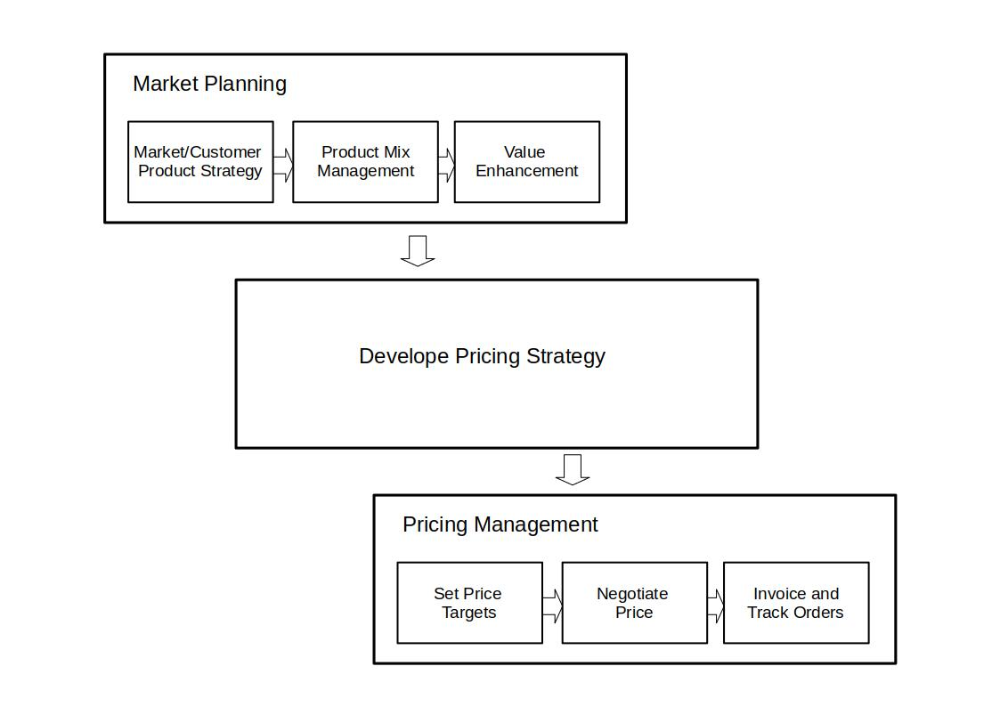
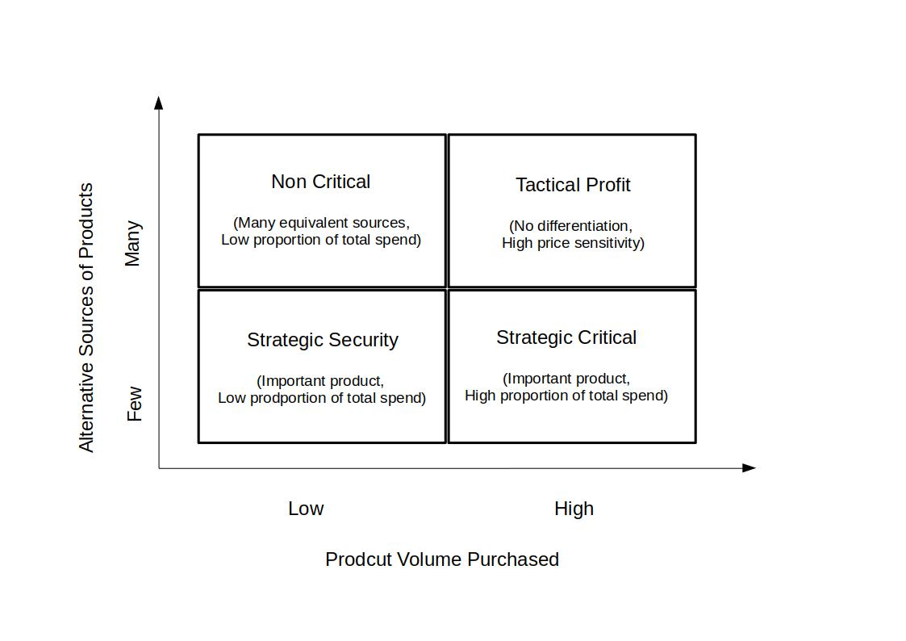

# Pricing Management of Chemical Goods

## Setting the Szene

Your employer in a manufactuer of polymer materials that are sold into a range of commodity and specialty applications. Recently, gowing competition from new manufacturing facilities, primarily in China and India are on the market. Market prices have declined steadily over a period of several years. 
Two sales campaignes that attempted to renegotiate prices so as to meet at least a 5 percent price increase. The campaines cover two very different periods, one where the product was in undersupply and one wheere it was in oversupply.

The company management is worried about the possibility of further price decline, because the know that further significant cost cutting is not possible.
They realizes that despite several recent attempts to impose price increases, both margin and profitabilit have continued to be eroded.

You got a clear instruction:
" Go out and fix the pricing process - it is broaken !"

Recent attempts ro renegotiate prices with customers have been unsuccessful. 4 sparate attempts to increase prives over the last 2 years. Each of them was directed at achieving a 5 percent prive increase across the customer base. None, was successful.

## Team 

You get a small team:
- 2 sales representatives
- a sles clerk
- financical analyst, who knows about the IT systems to get the data

## Defining the Process

You and your team agree that  they should focus on improving the pricing management process, which is the process that consists of setting price targets, negotiating prices with customers and invoicing and tracking orders after a succcessful sale.

You talk to the management and got "Green lights" to concentrate on the Pricing Management Process, since the Management Team is working on the Market and Product Mix Planning.

## Constructiong Analysis Data

You decide that your primary Y will be a measure of the prive increase. For each sale, you define this as the difference between the prive charged for the product after the negotiation and the price before the increase, devided by the price before the increase.
This measure eliminates any currency exchange rate fluctuations.

The market of your company is highly volatile and can change from demand exceedig supply (a shortage) to supply exceeding demand (an oversuppliy) in just six to twelve months, depending on  number of factors:
- cyclic characteristics of end unser mrkets
- fluctuating oil prices (a key raw meaterial)
- new compatetors on the market (form china and india)

After brain storming with the team to identify useful data for the investigation. You need information on the experience of the slaes representative and on the sophistication of the buyer involved in each sale. But it would not make sense to use a large set of unstructured and possibly uninformative sales data. 
You decide to retroactively design and assemble a data set for youre baseline assessment, to ensure that you  have data on the relevant background variables and minimize the time you sepnd researching and constructing the values of related variables.

## Baseline assessment:

- Products: 20 products as basis for the study. The products are sold in volume and have a respectable (>30 %) market share.

- Customers: 4 territories (UK, France, Germany, Italy): 20 products, 3 customers (range of different sizes) from each of the 4 regions, means 20 x 3 x 4 = 240 customers. Customer size is defind as the annual volume in sales. 

- Supply / Demand Balance: to include the effect of market conditions in the analysis. 1. demand was close to exceeding supply, relative shortage. 2. (12 month later)  the market has shifted with new competetors and a oversupply.

### Data set

You construct a data table whose rows are defined by all possible combinations of the 20 products, the 12 customers (3 customers in 4 regions) and the 2 supply / demand balance periods. 
this leads to 20 x 12 x 2 = 480 records. 

Additionally you obtain the following inforation for a sale:

- Sale Representative Experience: You believe that the experience of the sales representative is a factor of interest. The sales manager helps you to classify the sales representatives into three categories of exerience: high, medium and low.

- Buyer Sophistication: Because negotiation is a two-way undertaking, you want to explore the relationship between the experience of the sales representative and the experience of the buyer. You sit down with the sales manager to categorize the buyer sophistication for ech customer that bought one of the 20 products under consideration. 

- Product Category: Based on the Buying organization view and uses of the product it get classified into the Product Categorization Matrix.

- Annual Volume  Purchased. This is the total amount spent by each customer for this product over the year in which the supply/demand balance period falls.

- % Price Increase (Y). This is computed by taking the difference between the price charged for the product after the negotiatd increse and the price that would have been charged before the increase and divided by the price before the increase.

## Product Categorization Matrix

- Strategic Security: for which the buyer has few alternatives. These products may be unique or specific to the customers process but represent a low proportion of the buyer's spending. These products should be able to command a high price and the buyer should be relatively insentive to price increases. The key taks of the buyer is to ensure the security of his business by guaranteeing a supply of these strategic products almost at any cost.

- Strategic Critical: for products for which the buyer's spending is very high. Small changes in price will have a high impoact on the buyer's overall spending. Therefore, the buyer will typically be more sensitive to price. The critical task of th buyer is to purchase these strategic product at minimal cost.

- Tactical Profit. The buyer has several options, as there are competitive products with similar characteristics available. The products represents a high proportion of the buyer's spending, so the buyer will make tactical purchasing decisions based on maximizing his profit. These are typically commodity products. There is little differeentiation and high price sensitivity. It will be difficculat to increase the price for these products. Any attempt to do so will encourage the buyer to purchase from a competitor and the business will be lost.

- Non Critical: are porducts that represent small-volume purchases for the buyer. There are many equivalent products available and the products represent a small overall cost. Decisions regarding the purchase of these products will be based on criteria other than price, such as ease of doing business, lead time and similar factors.

The buyer will typically epend effort in two areas of the matrix: Strategic Security products and Strategic Critical products.

The buyer will be sensitive to price in two areas: Stategic Critical and Tactical Profit.

The buyer's ultmate strategy is to move all of his products to the Tactical Profit quadrant, where he can play one supplier against another, or at least to make his suppliers believe tat their products are in this quadrant.

The thinking about price sensitivity is situaltional - it is quite different from simply setting a list price for each product, and will give sales representatives greater insight into the price increase a specific transaction may bear. 

### Meeting with marketing and sales

Based on the product category matrix and some representatives of marketing and sales and their knowledge in categorizin the transactions the baseline data set gets created. 

[Part2](./Readme_part2.md)

