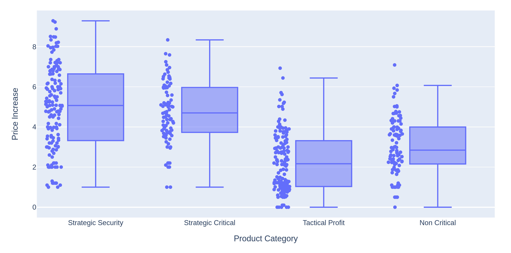

# Baseline Data set

Remember: 
From the 2 periods during which 5 percent price increase were targeted, you have identified 20 products and for each product 12 customers representing various sizs and regional locations (3 customers per region). Each of these product and customer combinations had ales in each of two peridos oversupply and shortage. 
This result in 480 different product-by-customer-by period combinations.

These data get enriched by entering the Product Categorization Matrix categories along with the sales representative experience and buyer sophistication rankings.

You add one more column: achived a 5 percent increase as **pricing defect** (**Defective**).

These Baseline Data you find [here](./data/baseline.csv)


### The Idea of the baseline analysis is to understand the capability of the current pricng management process under the 2 different market conditions of Oversupply and Shortage.

You are interested in the percentage of defective sales in the different periods.


To get the exact percentages and counts this gets very easy with pandas.

```bash
data_crosstab = pd.crosstab(data["Supply Demand Balance"],data["Defective"], margins = True)
data_crosstab

Defective               No  Yes  All
Supply Demand Balance               
Oversupply              34  206  240
Shortage               101  139  240
All                    135  345  480


data_crosstab2 = pd.crosstab(data["Supply Demand Balance"],data["Defective"], margins = True, normalize=True)
data_crosstab2


Defective                    No       Yes  All
Supply Demand Balance                         
Oversupply             0.070833  0.429167  0.5
Shortage               0.210417  0.289583  0.5
All                    0.281250  0.718750  1.0


data_crosstab3 = pd.crosstab(data["Supply Demand Balance"],data["Defective"], margins = True, normalize="index")
data_crosstab3

Defective                    No       Yes
Supply Demand Balance                    
Oversupply             0.141667  0.858333
Shortage               0.420833  0.579167
All                    0.281250  0.718750

```

You see that in periods of Oversupply about 86 % of the sales in your data are defective, while in periods of Shortage, about 58 % are defective.
This finding makes sense.

Even in times of Shortage, when the account managers are in astrong negotiationg position, your company suffers a high pricing defect rate. An estimated 58 % of the sales negotiations are defective.


If you break down this chart by Supply Demand Balance there is a difference.

```bash
import plotly.express as px

fig =  px.histogram(data, x="Price Increase", color = "Supply Demand Balance", nbins=20, marginal="box")
fig.show()
```


The plot shows that Price Increases are higher in periods of Shortage than in periods of Oversupply. This is not unexpected.


The Price increases are 2.7 % and 4.7 % (mean) in the periods while both means are below the desired 5 % increase.

There is high potential for improvement. 


## Going further

You like to explore which Xs might be influencing Y. We highlight the areas that represent for a Defective.

The Charts of Supply Demand Balance, Buyer Sophisication and Product Category have different distributions based on whether Defective is Yes or No.


```bash

for element in data.columns:
    fig = px.histogram(data, x = element, color = "Defective" )
    fig.show()

```


It seem to have no effect on the region. The root cause may be related to the *Product Category* as assigned using the Product Categorization Matrix. 

The highly experienced account managers appear to be no more effective in increasing the price than those who are less experienced. What a surprise.

However, the most interesting X appear to be Buyer Sophistication. With highly sophisticated buyers, the proportion of pricing defcts is much higher than for buyers who have Medium or Low sophistications. We conclude that these buyers use highly effetive price negotiations to keep prices low.





Just play a bit with the data and get more familiar with these dataset.

[Part3](./Readme_part3.md)


