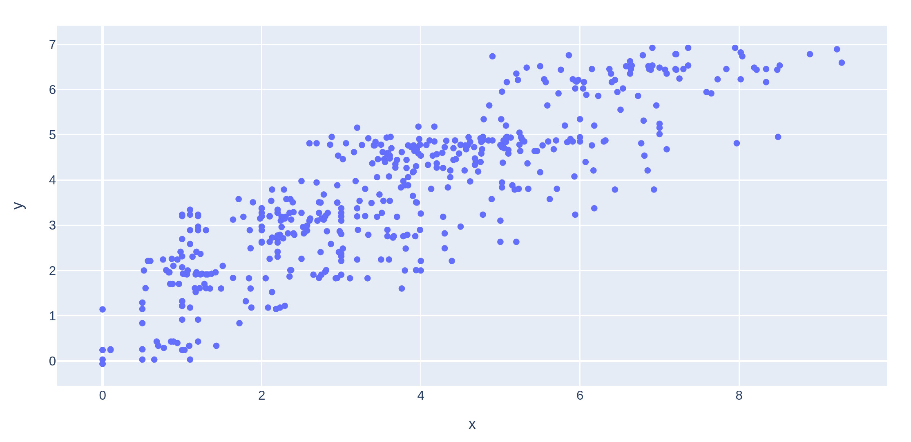

# Modelling Reationships


You have a continuous varaible (Price Increase in %) that is already a very good response and maybe suitable for modelling as a function of Xs. 

But which X you need to include and how about interactions, which the parition analysis clearly indicated that there are important interactions.


There seem no reason to include *Customer ID* or *Sales Rep* as these variables do not easil hep you to address the root cause.

*Region* incontrast seem to be an interesting variable and sounds reasonable that there are interactions between Region and other variables.


You start to model in [this](./source/modelling.py) script.

With sklearn we can make easi use of categorical columns in a data frame. They get Encoded into 0 and 1s for each value factor in a categorical column.

```bash

from sklearn.compose import make_column_selector as selector
from sklearn.compose import ColumnTransformer
from sklearn.preprocessing import OneHotEncoder


categorical_columns_selector = selector(dtype_include=object)
categorical_columns = categorical_columns_selector(subdata)
# ['Region', 'Supply Demand Balance', 'Sales Rep Experience', 'Buyer Sophistication', 'Product Category', 'Price Increase']

# make a ColumnTransformator for these columns
t = ColumnTransformer(transformers=[
    ('onehot', OneHotEncoder(), categorical_columns),
    # ('scale', StandardScaler(), ['col1', 'col2'])
], remainder='passthrough')


# Transform the features
features = t.fit_transform(subdata.loc[:, categorical_columns])

```


The most significant (p-value <= 0.05) are:
- Product Category  
- Buyer Sophistication
- Buyer Sophistication*Product Category
- Supply Demand Balance
- Sales Rep Experience*Product Category


and we can make a good prediction with these features used in the model.




Interestingly, Sales Rep Experience has appeared in the list. On its own, it is not significant but in is influential through is interaction with Product Category.
In the partition analysis we used a nominal ersio of the response. Now we used continous instead of nominal variables (that tend to carry less information). 
Here we used a multiple linear regression that shows an interaction that was not seen earlier.


From the first plot, we conclude that there is some evidence that High- and medium- experience sales representatives tend to get slightly higher prices increases that low experienced sales representatives for Strategic Security Products. 


In the second plot, you see the effect of High-sophisticated buyers, to negotate lower price increases across all categories and especially for Strategic Security products (ca. 3 % lower than low or medium sophistication buyers).


These findings are consistent with and extend the conclustions that you drew earlier from your exploratory analysis.

[Part4](./Readme_part4.md)


