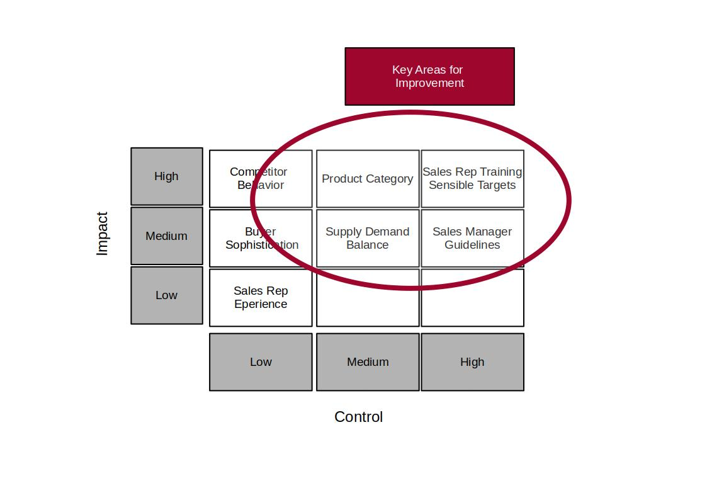

## Revising Knowledge and Optimal Strategies

At this point, you are confident that you have identified a number of Hot Xs. 
You involve your team members and a larger group of sales representatives for a open discussion of these findings.

There are several workshops and presentations and you collect good feedback from your collegues. 

Highlights:

- Need of more training in negotiation skills

- Need of more realistic sales management guidelines and price targets through a tailored price management process. A target of 5 % across the board is seen unrealistic and a more fine tuned approach makes more sense. 

You consolidate your findings for a summary meeting with the management. You summarize the identified X from a combination of the data analysis and the sales representatives inputs into an Impact and Control Matrix.

The Impact axis is the relative size of the impact that an X has on overall process performance.
The Control axis relates to the degree of control or influence that can be exercised on this X through process redesign.

The *Supply Demand Balance* itself cannot be directly controlled but it can be controlled the timing to ensure that price increases are only attempted when the overall supply/demand balance is favorable, like in periods of relative shortage.

## Improvement Plan

Together with the management team you woked on an improvement plan focusing on 4 key areas:

- Product Category
- Sales Representative Training
- New Rules for Supply/Demand Balance Decisions
- Price Management Process Redesign

# Pricing Improvements

The mean price increase for after the implementation of the Improvement Plan:

- Strategic Security: 7.7 %
- Strategic Critical: 8.4 %
- Tactical Profit: 2.6 %
- Non Critical: 4.9 %

## Benefits:

After the pilot phase an yearly revenue increase of ca. 2 Mio € was achieved. 

A Price Index based on products on price of a fixed volume of selected products is introduced for quarterly reviewing.

