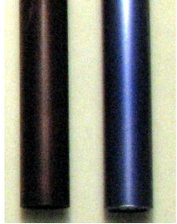
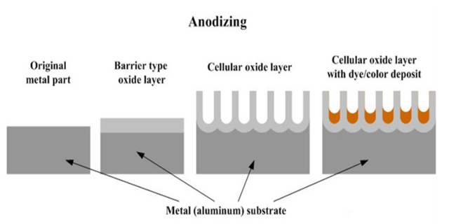
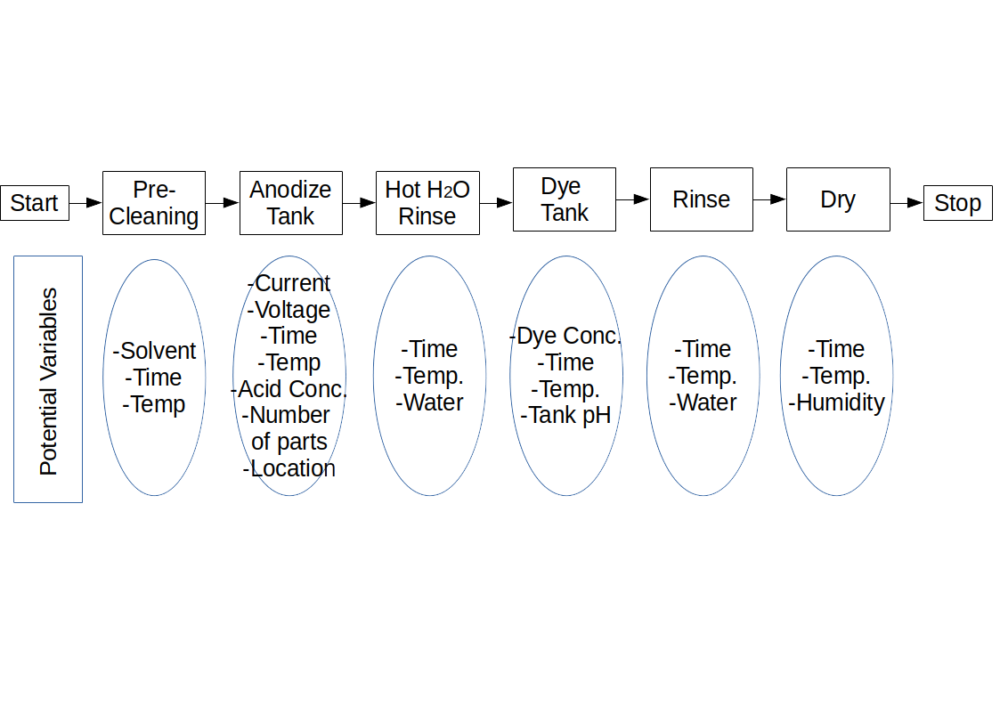

# Quality Improvements of Anodized Parts

## Setting the Szene

Your employer in a manufactuer of high end aluminium parts. 
The components are anodized to protect against corrosion and wear. The anodized parts are dyed to produce a smooth, rich and black surface to have a visually pleasing product surface.

In late 2014 the first problems with chronic discoloration have been reported.

Lot yield, determined by an outgoing visual inspection, ranges from 0 to 40 percent. 
There is a lot of rework and the on-time delivery of components is very poor. In addition, the quality of shipped components is often bad when assessed by the customer. 

Unless the aluminium part company cannot improve yield and optimize the quality, it may loose millions of euro and the business with its major customer.

(This picture is from a google search result, to visualize the color effect problem.)

## A bit of chemistry

The anodizing process is referred to as a Type II anodization, where the anodizin is done in a sulfuric acid bath. The parts are suspended in the acid bath and a direct current is appplied in such a way that the parts become the anodes of an electrolytic cell. Oxygen is generated on the surfaces of the aluminium parts, causing a building of aluminium oxide . The parameters used in the anodizing process not only have a significant impact on the coating thinckness but also affect the shape and size of pores that form in the coating. This in turn affects the ability of the anodized surface to retain dye or other coatings.

[Literature](https://waykenrm.com/blogs/anodizing-aluminum-cost/)

## Types of Anodizing Aluminum Processes Available

Military specification MIL-PRF-8625 Type II acid sulfur anodizing and Type III hard coat anodizing are the most commonly used. Type II is widely called regular anodizing, while Type III is called tough or hard anodizing. What about Type I? We’ll get to that in a moment.

The three types of anodizing per MIL-PRF-8625 are as follows:
Type I

- Type I and IB – Chromic Acid Anodizing
- Type IC – Non-Chromic Acid Anodizing as a replacement for Type I and IB

Type II

- Type II – Conventional coating from a sulfuric acid bath
- Type IIB – Non-chromate alternative for Type I and IB coatings

Type III

- Type III – Hard Anodize

Each type of anodization creates different functional and aesthetic characteristics:

-Types I, IB, and II are used for corrosion, abrasion resistance, and paint preparation. For applications that are fatigue critical, Types I and IB are used because they are a thinner, more flexible coating — for example, these types are often applied to highly fatigued structural components on aircraft.

-Types IC and IIB are used when a non-chromate alternative is desired, often due to environmental regulations or requirements. When developing systems in the defense industry, new contracts require environmentally friendly options (Types IC and IIB) because of the hexavalent chromium in Types I and IB.

-Type III is used primarily to increase abrasion and wear resistance. It’s a much thicker coating that outperforms the other types for abrasion and wear. This coating may reduce fatigue life, however. Type III anodize is frequently used on firearm components, gears, valves, and other parts that slide relative to each other.

All anodizing helps the adhesion of paints and some other bonding agents as compared to bare aluminum. In addition to the anodizing process, some parts may be dyed, sealed, or treated with other materials, such as dry film lubricant. If a part is dyed, it’s considered Class II, whereas an undyed part is Class I per the MIL-PRF-8625 specification. [Literature](https://www.fictiv.com/articles/aluminum-anodizing-all-you-need-to-know)

## Team 

You are alone.

There is no Team around you.

## Defining the Process

Producing an anodized aluminium part is complex with several steps. 

Several possible variables on each process step have been identified.

4 Quality Aspects: 
- CIELAB (L*, a*, b*)
- coating thinckness

## Framing the Problem

Currently, the black anodizing process has very low daily yields, usually below 40 % and aerging 19 %. This results in high scrap and rework costs. 
Also, the largst customer is threatening to find another supplier if quality and on-time delivery are not substantially improved. 
In the past 6 months, scrap and rework costs have totaled approximately 450 k€ with on-time delivery below 60 %.

## KPI

Improve the black anodized process yield from 19 % to  minium of 90 % (in 6 month).
This KPI is the lot-by-lot yield. 

## Scope

The project will address only the black anodizing process. All other manufacturing steps are out of scope for this project.

[Part2](./Readme_part2.md)

