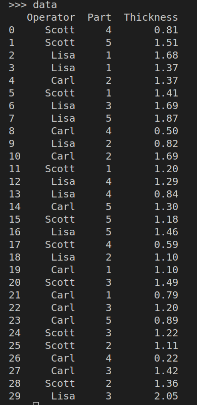
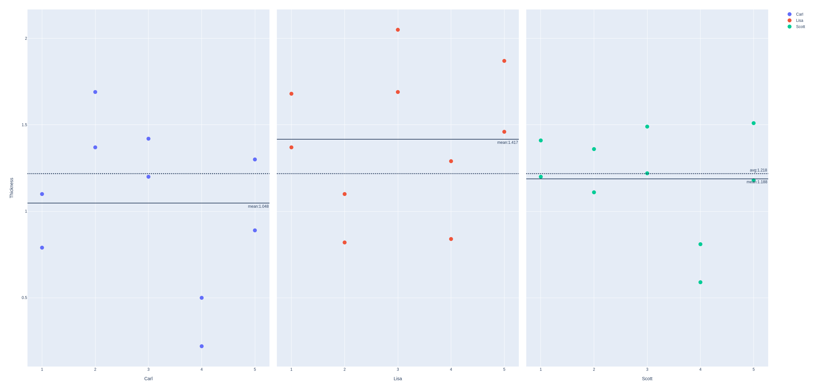
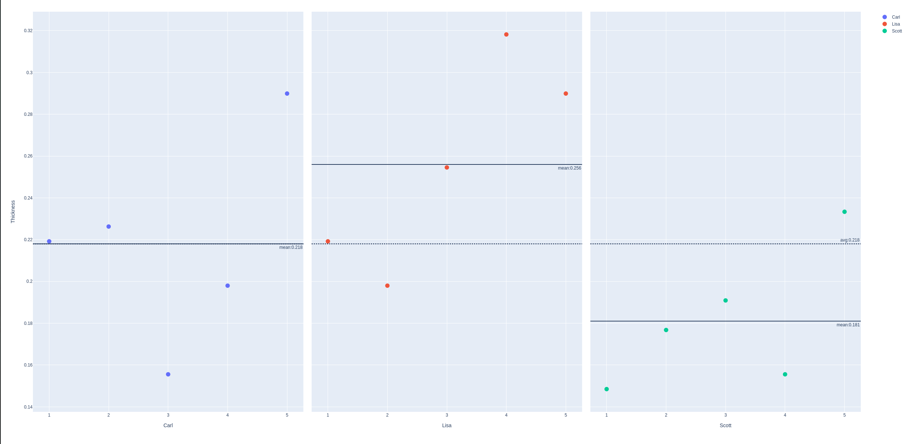
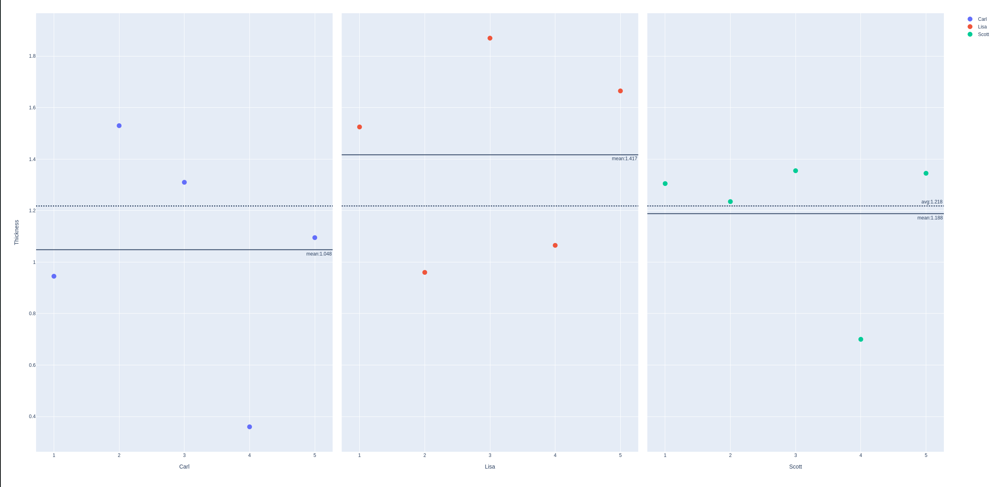

# Collecting Data

## Graph Data

Since the process is complex enough, we will have a closer look into graph organized data structures.


Maybe we will try to fetch data from Microsoft Kusto via Graph based main process view.


## Quality Parameters

there are four continous CTQs for the anodizing process: 
anodized coating thickness and the treee color coordinates. 

## Critical to Qualit (CTQ)

There are 4 continuous measured quality aspects:

- coating thickness
- 3 clor coordinates

These things are measured with 3 different measurement systems:

- backscatter gauge
- spectrophotometer
- vsiual color inspction rating that classifies parts as good or bad


### CIELAB


*L** is a measure of lightness of the color (the range is 0 - 100), with lower values indicating darker color

*a** is a measure of red/green. Positiv values indicate redness and negative values indicate greeness.

*b** is a measure of yellow/blue. Positiv values indicate yellowness and negative values indicate blueness.


### MSA Backscatter Gauge

The Backscatter Gauge is to measure thickness.

1 Gauge is used but up to 12 operators may measure.


The MSA is preformed with:
- 1 gauge
- 3 random operators (out of 12)
- 5 random parts (which are measured twice)

This will be done with a DOE Full Factorial Design. The study will be performed in a complete random order.

We will make a Multi-Vari plot.

[Here](./source/multi_vari.py) are the basic plot functions, while [here](./source/usage_multi_vari.py) is the usage of the functions.

This are the data of the MSA:



The chart for *Thickness* shows for each Operator and Part, the two measurements obtained by that Operator.




Since there are several values for each Operator and Part, we can calculate the standard deviation. 



Regarding the average values for each Operator and Part, we see the wide range from about 0.22 (Carl, Part 4) to around 2.00 (Lisa, Part 3).


In a MSA, the focus is on the variation inherrent in the measurement process itself rather than on studying part-to-part variation.


### Improvement of *Thickness* Measurement

Back to the *Thickness* measurement the accuracy should be at least 0.1, since it need to be measured between 0.0 and 1.6 .


- Measuements on the same Part made by the sampe Operator can differ by 0.2 - 0.45.

- Different Operators differ in their overall measurement of the parts, see the average values for all parts for the different operators.

- There are differential effects in how some operators measure some parts. In other words: there is an **Operator by Part** interaction. See Part 2, which is measured high by Scott and low by Lisa.


To interprete these data we will also use an gage r&r (six sigma approach): 

```bash
                                repeatabilit
                                |
                    gage r & r--|               operator
                    |           |               |
total variability --|           reproduibility--|
                    |                           |
                    part-to-part                interaction

```

When using the [Gage_RnR](./source/Gage_RandR.py) we can generate the graphics but also this table: 

```bash

                    names  variations  percent of total
0                Gage R&R    0.089643            50.576
1           Repeatability    0.050163            28.302
2         Reproducibility    0.039480            22.274
3   Interaction Variation    0.019591            11.053
4  part-to-part Variation    0.068010            38.371
5         Total Variation    0.177244           100.000

```

**Repeatablity**: Repeated easurements of the same part by the same operator with the same instruments

**Reproducability**: Repeated measurements of the same part by different operators using different instruments

**part-to-part Variation**: Differences in the parts used in the MSA: here parts are represented by batches

**Interaction Variation**: Differences due to the interaction components. Here the interaction components are *Operator x Instrument*, *Operator x Batch* and *Instrument x Batch*.

It can be seen that the Gage R&R component is very large compared to the product variation (part-to-part) variance. This suggests that the measurement system has difficuty distinguishing batches.
A control chart monitoring this process is mainly monitoring measurement variation. 

The *Batch* variation accounts is ca. 40% of the total variation.

Recalling that the measurement system range, measured as six standard deviations should take up at most 10 % of the tolerance range, which is 10 % x (1.6 - 0.0) = 0.16 units.

The standard deviation of the measurement system is about (0.0896 / 2) x 6 = 0.268 units which is much higher than the expected 0.16 units.


### Difficulties when measuring a sample

The 3 Operators checked each other when performing the measurement and found:

- diffculty in repeating the exact positioning of parts 

- gauge proves to be sensitive to the positioning 

- amount of pressure appllied to the gauge head on the part affet the thickness measurement

- operators do not calibrate the gauge in the same manner, which lead to reproducibility variations


### Measurement improvements

The metrology department and a few operators worked together to design a fixture that 

- automatically locates the gauge on the part

- adjust the pressure of the gauge head on the part

- the team define and implement a standard for calibration practice.


### MSA Visual Color Rating


## Data Collection


[Part3](./Readme_part3.md)


