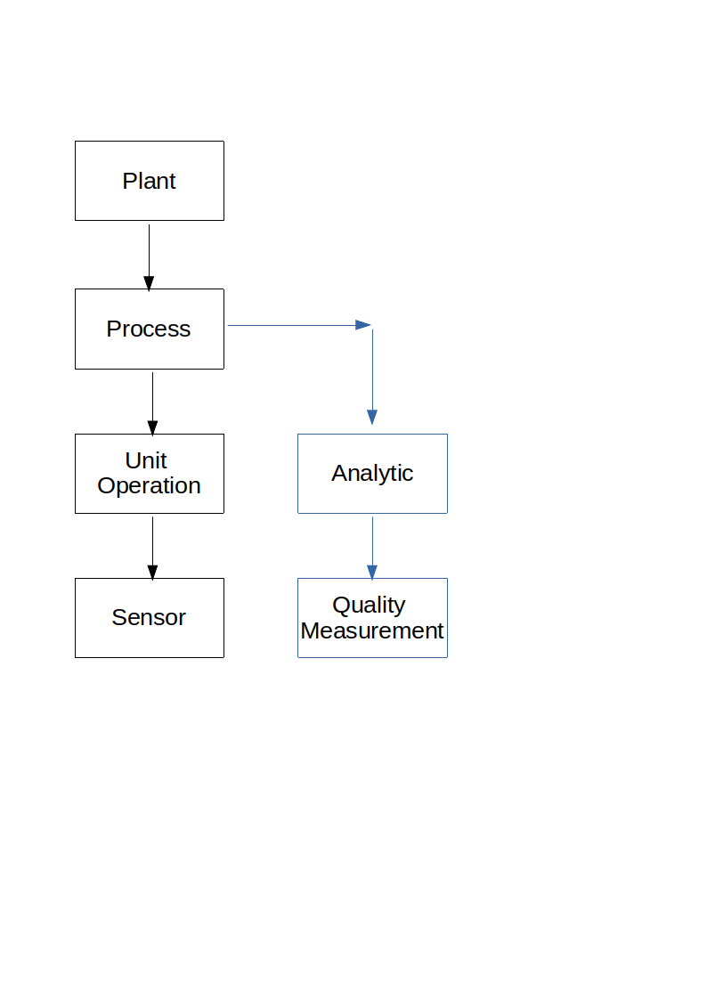
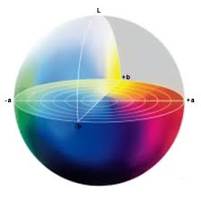

# Collecting Data

## Graph Data

Since the process is complex enough, we will have a closer look into graph organized data structures.

Maybe we will try to fetch data from Microsoft Kusto via Graph based main process view.

## Quality Parameters

there are four continous CTQs for the anodizing process: 
anodized coating thickness and the treee color coordinates. 

## Critical to Qualit (CTQ)

There are 4 continuous measured quality aspects:

- coating thickness
- 3 clor coordinates

These things are measured with 3 different measurement systems:

- backscatter gauge
- spectrophotometer
- vsiual color inspction rating that classifies parts as good or bad

### CIELAB

*L** is a measure of lightness of the color (the range is 0 - 100), with lower values indicating darker color

*a** is a measure of red/green. Positiv values indicate redness and negative values indicate greeness.

*b** is a measure of yellow/blue. Positiv values indicate yellowness and negative values indicate blueness.

### MSA Backscatter Gauge

The Backscatter Gauge is to measure thickness.

1 Gauge is used but up to 12 operators may measure.

The MSA is preformed with:
- 1 gauge
- 3 random operators (out of 12)
- 5 random parts (which are measured twice)

This will be done with a DOE Full Factorial Design. The study will be performed in a complete random order.

We will make a Multi-Vari plot.

### MSA Visual Color Rating

## Data Collection

[Part3](./Readme_part3.md)

