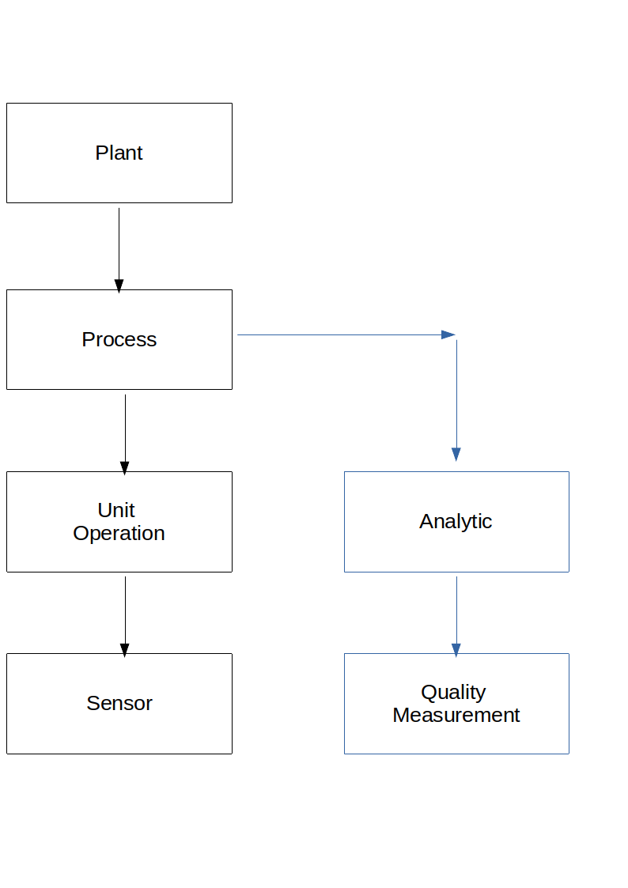

# Collecting Data

## Graph Data

Since the process is complex enough, we will have a closer look into graph organized data structures.

Maybe we will try to fetch data from Microsoft Kusto via Graph based main process view.

## Quality Parameters

### CILAB

### MSA Backscatter Gauge

### MSA Visual Color Rating

## Data Collection

[Part3](./Readme_part3.md)

