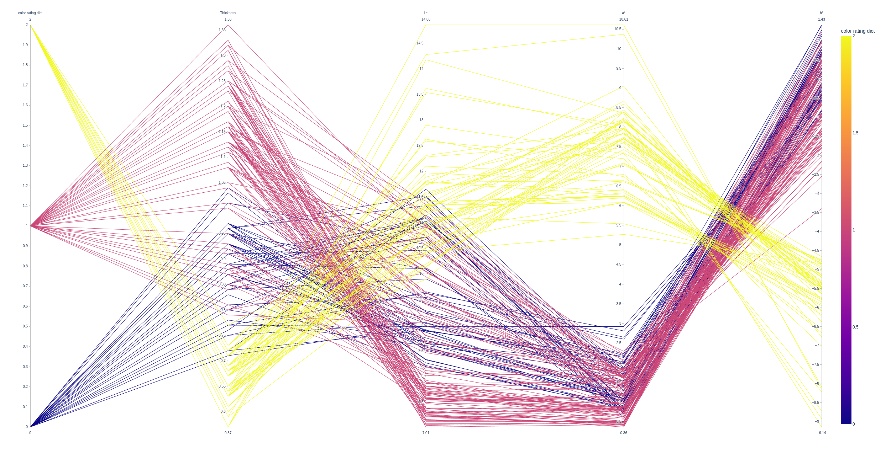

# Data Collection for process improvement

## The Master Plan

The **Color Rating** is  visual measurement of an acceptability. 

This nominal measurement does not provide a sensitive indicator of process behavior. This is the reason we are focussing, right from the start, on *Thickness* and the 3 color measurements (L* , a* , b*) as continuos surrogates for the Color Rating.

The long-term strategy is to find a significant relationship between the color rating and the color measurement as well as a significant relationship between the continuos color measurements and process conditions.

The idea is to produce in the "optimal" process window.

## Draw backs

Yet, there are no specifiation limits for *Thickness*, *L**, *a** and *b**. 


### Action Plan:

1. Find Relationship between Color Rating and *Thickness*, *L**, *a** and *b**.

2. Specification Limits for *Thickness*, *L**, *a** and *b**.

3. Identify process conditions to produce within the specification limits of *Thickness*, *L**, *a** and *b** to produce parts that get a good color rating.


## Uncovering Relationships between Color Rating and continuos measured quality aspects

We have to replace the string classification in the dataframe by a number. (0 = normal Black)

```bash

exchange_dict = {"Normal Black": 0, "Smutty Black": 1, "Purple/Black": 2}

data["color rating dict"] = data['Color Rating '] 
data["color rating dict"] = data["color rating dict"].replace(exchange_dict)

data["color rating dict"] = [int(element) for element in data["color rating dict"]]

```



It is also easy to set the specification limits to almost obtain classification level 0 (Normal Black). 


### Specifications

Using the information from the parallel coordinate plot, we can see that the four Ys should be in a specific range to produce acceptable *normal black* parts. 

I would assume the specification limits like this, to have good normal black parts. How would you set the limits?!

```bash

| Variable   | Target | Spez. Range |
-------------------------------------
| Thickness  |  0.85  |    0.15     |
|    L*      |  9.75  |    1.75     |
|    a*      |  1.5   |    1.5      |
|    b*      |  0.0   |    1.5      |
-------------------------------------

```


[Part4](./Readme_part4.md)


