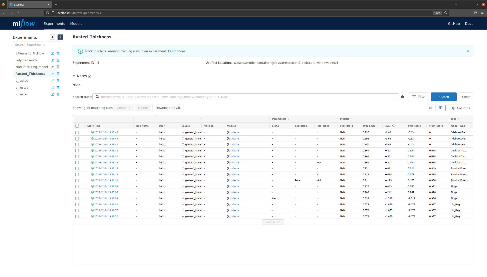
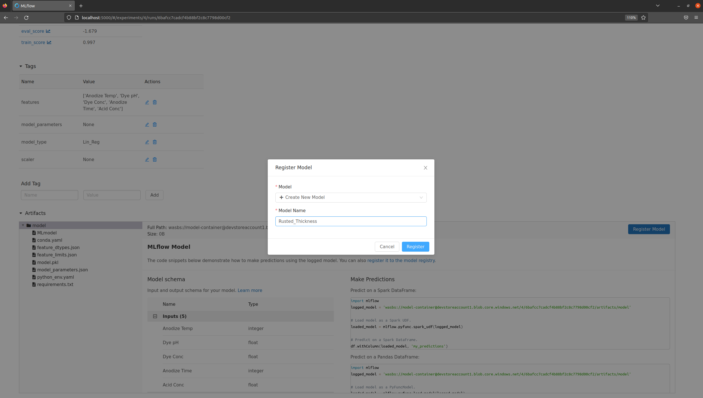
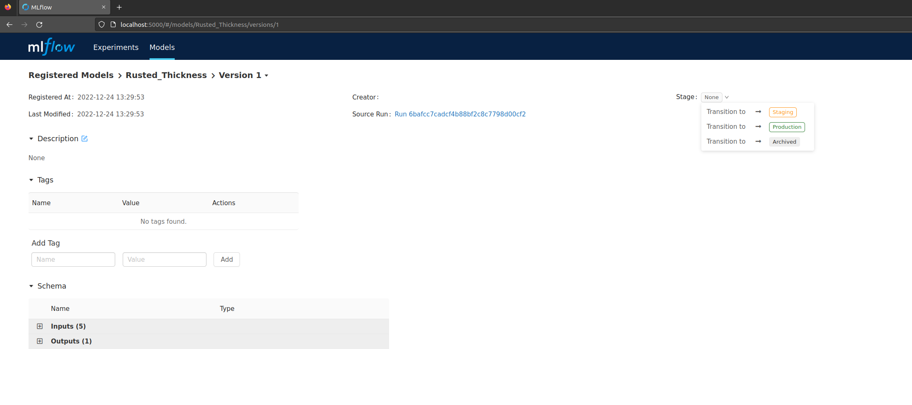

# Modelling

## DOE Design

We plan a Doe experiment and will set the limits for this as we have seen from the specifications.

```bash

| Variable   | Target | Spez. Range |     Range    |
----------------------------------------------------
| Thickness  |  0.85  |    0.15     |   1.0 - 0.7  |
|    L*      |  9.75  |    1.75     |  11.5 - 8.0  |
|    a*      |  1.5   |    1.5      |   3.0 - 0.0  |
|    b*      |  0.0   |    1.5      |   1.5 - -1.5 |
----------------------------------------------------

```


## Modelling

### MLFLow

We stay with the MLOps Approach and will train several models for:
- Thickness
- L*
- a*
- b*

with the script for MLFlow. 

We only need to change the trainings.yaml file

```bash
# in    training_config.yaml

data_load: "/home/heiko/Repos/Playground/multi_vari_msa/data/Anodize_CustomDesign_DOE_Results.parquet"

###########
# Target: #
###########

# target: "Thickness"   # select on of the targets and pic the correct name :)
target: "L*"
# target: "b*"
# target: "a*"


features:
  - "Anodize Temp"
  - "Dye pH"
  - "Dye Conc"
  - "Anodize Time"
  - "Acid Conc"


MLFlow: True # False #True

# MLFlow_Experiment: "Rusted_Thickness"   # select on of the MLFlow names
MLFlow_Experiment: "L_rusted"
# MLFlow_Experiment: "b_rusted"
# MLFlow_Experiment: "a_rusted"


test_split:
  test_size: 0.3     # less data points, otherwise it gives an error :)
  random_state: 2021


```


Please change the inputs for `MLFlow_Experiment` and `target` and run it several times. 


After we made all for runs we can see in MLFlow (localhost:5000) the models. For each Target its own Experiment with at least 15 different models, with or without a scaler, simple or complex models and their performance as matrics.




### Next Steps

We need to select a model to make it a model and then we need to stage it.

I call my models:

- Rusted_Thickness
- Rusted_L
- Rusted_a
- Rusted_b

to make it very simple i also use the linear regression models as registered models.






### Small Comment
Version Conrol of MLFlow, pandas and numpy is everything. I had a few problems and stayed with the old configuration of:

```bash

[tool.poetry.dependencies]
python = ">=3.8.1,<3.9"
pandas = "^1.5.2"
numpy = "<=1.21.3"   # else mlflow is not working
plotly = "^5.11.0"
openpyxl = "^3.0.10"
statsmodels = "^0.13.5"
scikit-learn = "*"
mlflow = "1.14.1"
protobuf = "<3.20"   # else mlfow is not working

azure-storage-blob = "==12.7.1"
azure-identity ="^1.7.0"

```

Just in case it got lost :)


## Working with the Models

The best way to gain knowledge and to work with these models is to have an interface to these models. 

We as data scientist can directly use the models out of MLFlow but what is the best way for non-data scientists?
How should we provide someone these models and the hidden informations in the crosslinking of all models?


[Here](./source/mlflow_expand_functions.py) and [here](./source/usage_mlflow_expand_functions.py) are some functions to to get the informations from your local mlflow server and to work with them.

I guess this is already nice but not sufficient for a workflow that we like to have and which is maybe available in proffesional software solutions like `JMP`, `matlab`, `origin` and co.


```bash

import pandas as pd

from source.mlflow_expand_functions import (
    get_mlflow_model,
    get_model_json_artifact,
    read_model_json_from_blob,
    create_all_model_json_dict,
    flatten_dict,
    flatten_consolidate_dict,
    create_warning,
    decode_df_mlflow_dtype
)


# models:  
# Rusted_Thickness
# Rusted_L
# Rusted_a
# Rusted_b


Rusted_models = [
    "Rusted_Thickness",
    "Rusted_L",
    "Rusted_a",
    "Rusted_b"
]


model_Thickness= get_mlflow_model(model_name=Rusted_models[0], azure=True)


# for one model
model_featues=get_model_json_artifact(
                    azure=True,
                    path=None,
                    model_name=Rusted_models[0],
                    features="feature_limits.json",
                )
model_featues


model_dtypes=get_model_json_artifact(
                    azure=True,
                    path=None,
                    model_name=Rusted_models[0],
                    features="feature_dtypes.json",
                )
model_dtypes


# or for all models
feature_dtypes_dict = create_all_model_json_dict(local=False,
    list_of_models=Rusted_models,
    features="feature_dtypes.json")
feature_dtypes_dict


feature_limits_dict = create_all_model_json_dict(local=False,
    list_of_models=Rusted_models,
    features="feature_limits.json")
feature_limits_dict


# for all the data types
dtype_dict=flatten_dict(nested_dict=feature_dtypes_dict)
dtype_dict

# for all the limits
limits_dict=flatten_dict(nested_dict=feature_limits_dict)
limits_dict


AT = 70   # 60..90
DpH = 5.5   #5.0 .. 6.5
DC = 12.5   # 10.0 .. 12.5
AT = 30    # 20..30
AC = 190   # 170..205


data = pd.DataFrame(
    data=[[AT, DpH, DC, AT, AC]],
    columns=[
        "Anodize Temp",
        "Dye pH",
        "Dye Conc",
        "Anodize Time",
        "Acid Conc",
    ],
)
data

data = decode_df_mlflow_dtype(data = data, dtype_dict=dtype_dict)

data
# >>> data
#    Anodize Temp  Dye pH  Dye Conc  Anodize Time  Acid Conc
# 0            30     5.5      12.5            30      190.0


Rusted_models = [
    "Rusted_Thickness",
    "Rusted_L",
    "Rusted_a",
    "Rusted_b"
]


model_Thickness= get_mlflow_model(model_name=Rusted_models[0], azure=True)
model_L= get_mlflow_model(model_name=Rusted_models[1], azure=True)
model_a= get_mlflow_model(model_name=Rusted_models[2], azure=True)
model_b= get_mlflow_model(model_name=Rusted_models[3], azure=True)


model_Thickness.predict(data)[0]   #  -0.182857
model_L.predict(data)[0]           #   2.27619
model_a.predict(data)[0]           #  10.992857
model_b.predict(data)[0]           #  -7.919523

```


## Optimal Control with Generic Optimizier

I guess it is also worth to have a suggestion where the optimum may is. 
Therefor we use a generic optimizer to find the local minimum when we give it our targets for thickness and the color values.
[Here](./source/gen_opt/) are the scripts for the [functions](./source/gen_opt/setpoint_suggestion_genopt.py) and the [usage](./source/gen_opt/working_setpoint_suggestion_generator.py) of these functions to find the best set points of the process.

```bash


from src.gen_opt.setpoint_suggestion_genopt import (
    genetic_algorithm
)


import pandas as pd

from src.with_mlflow.mlflow_expand_functions import (
    get_mlflow_model,
    get_model_json_artifact,
    read_model_json_from_blob,
    create_all_model_json_dict,
    flatten_dict,
    flatten_consolidate_dict,
    create_warning,
    decode_df_mlflow_dtype
)


Rusted_models = [
    "Rusted_Thickness",
    "Rusted_L",
    "Rusted_a",
    "Rusted_b"
]


# or for all models
feature_dtypes_dict = create_all_model_json_dict(local=False,
    list_of_models=Rusted_models,
    features="feature_dtypes.json")
feature_dtypes_dict


feature_limits_dict = create_all_model_json_dict(local=False,
    list_of_models=Rusted_models,
    features="feature_limits.json")
feature_limits_dict


# for all the data types
dtype_dict=flatten_dict(nested_dict=feature_dtypes_dict)
dtype_dict

# for all the limits
limits_dict=flatten_dict(nested_dict=feature_limits_dict)
limits_dict


def create_testdata(AT=70, DpH=5.5, DC=12.5, At=30, AC=190):

    data = pd.DataFrame(
        data=[[AT, DpH, DC, At, AC]],
        columns=[
            "Anodize Temp",
            "Dye pH",
            "Dye Conc",
            "Anodize Time",
            "Acid Conc",
        ],
    )
    data = decode_df_mlflow_dtype(data = data, dtype_dict=dtype_dict)
    return data


model_Thickness= get_mlflow_model(model_name=Rusted_models[0], azure=True)
model_L= get_mlflow_model(model_name=Rusted_models[1], azure=True)
model_a= get_mlflow_model(model_name=Rusted_models[2], azure=True)
model_b= get_mlflow_model(model_name=Rusted_models[3], azure=True)


def create_bounds_list(names_order, bounds_dict):
    return [bounds_dict[element] for element in names_order]


def bounds_dict_generator(limit_dict):
    output = {}

    for key in limit_dict.keys():
        output[key] = [limit_dict[key]["min"], limit_dict[key]["max"]]

    return output


limits_dict

# >>> limits_dict
# {'Anodize Temp': {'min': 60.0, 'max': 90.0}, 'Dye pH': {'min': 5.0, 'max': 6.5}, 'Dye Conc': {'min': 10.0, 'max': 15.0}, 'Anodize Time': {'min': 20.0, 'max': 40.0}, 'Acid Conc': {'min': 170.0, 'max': 205.0}, 'Thickness': {'min': 0.39, 'max': 1.07}, 'L*': {'min': 1.05, 'max': 21.73}, 'a*': {'min': -2.48, 'max': 7.75}, 'b*': {'min': -7.93, 'max': 2.83}}

bounds_dict = bounds_dict_generator(limits_dict)

bounds_dict 
# >>> bounds_dict 
# {'Anodize Temp': [60.0, 90.0], 'Dye pH': [5.0, 6.5], 'Dye Conc': [10.0, 15.0], 'Anodize Time': [20.0, 40.0], 'Acid Conc': [170.0, 205.0], 'Thickness': [0.39, 1.07], 'L*': [1.05, 21.73], 'a*': [-2.48, 7.75], 'b*': [-7.93, 2.83]}


# | Variable   | Target | Spez. Range |     Range    |
# ----------------------------------------------------
# | Thickness  |  0.85  |    0.15     |   1.0 - 0.7  |
# |    L*      |  9.75  |    1.75     |  11.5 - 8.0  |
# |    a*      |  1.5   |    1.5      |   3.0 - 0.0  |
# |    b*      |  0.0   |    1.5      |   1.5 - -1.5 |
# ----------------------------------------------------

create_df_testing_cnames = ["Anodize Temp", "Dye pH", "Dye Conc", "Anodize Time", "Acid Conc"]


bounds = create_bounds_list(create_df_testing_cnames, bounds_dict)

bounds
# >>> bounds
# [[60.0, 90.0], [5.0, 6.5], [10.0, 15.0], [20.0, 40.0], [170.0, 205.0]]

target_names = ["Thickness", "L*", "a*", "b*"]
target = [0.85, 9.75, 1.5, 0.0]
std_target = [0.15, 1.75, 1.5, 1.5]


def loss_function(target, X):

    idata = create_testdata(AT=X[0], DpH=X[1], DC=X[2], At=X[3], AC=X[4])
    Thickness = model_Thickness.predict(idata)[0]
    L = model_L.predict(idata)[0]
    a = model_a.predict(idata)[0]
    b = model_b.predict(idata)[0]

    diff_Thickness = abs(target[0] - Thickness) #/ std_target[0]
    diff_L = abs(target[1] - L) #/ std_target[1]
    diff_a = abs(target[2] - a) #/ std_target[2]
    diff_b = abs(target[3] - b) #/ std_target[3]

    return diff_Thickness+diff_L+diff_a+diff_b


new_setpoints = genetic_algorithm(
    objective=loss_function,
    target=target,
    bounds=bounds,
    break_accuracy=0.005,
    digits=5,
    n_bits=16,
    n_iter=30,
    n_pop=100,
    r_cross=0.9,
    r_mut=None,
)
new_setpoints

# >>> new_setpoints
# [76.875, 5.59777, 11.26228, 37.19238, 204.93858]


# ["Anodize Temp", "Dye pH", "Dye Conc", "Anodize Time", "Acid Conc"]


# These data
testdata = create_testdata(AT=79.5, DpH=6.3, DC=11.2, At=39.6, AC=204.4)

# or these data
testdata= create_testdata(AT=new_setpoints[0], DpH=new_setpoints[1], DC=new_setpoints[2], At=new_setpoints[3], AC=new_setpoints[4])

# Make the modelling part
testdata["Thickness_pred"]= model_Thickness.predict(testdata)
testdata["L_pred"]= model_L.predict(testdata)
testdata["a_pred"]= model_a.predict(testdata)
testdata["b_pred"]= model_b.predict(testdata)


testdata

# >>> testdata
#    Anodize Temp   Dye pH  Dye Conc  Anodize Time   Acid Conc  Thickness_pred    L_pred    a_pred    b_pred
# 0            76  5.59777  11.26228            37  204.938583        0.707302  9.719687  1.502779 -0.194312


# | Variable   | Target | Spez. Range |     Range    |
# ----------------------------------------------------
# | Thickness  |  0.85  |    0.15     |   1.0 - 0.7  |
# |    L*      |  9.75  |    1.75     |  11.5 - 8.0  |
# |    a*      |  1.5   |    1.5      |   3.0 - 0.0  |
# |    b*      |  0.0   |    1.5      |   1.5 - -1.5 |
# ----------------------------------------------------


```

In the End we get values as set points that we should try to have our quality parameters in the optimal range.


```bash

#    Anodize Temp   Dye pH  Dye Conc  Anodize Time   Acid Conc  Thickness_pred    L_pred    a_pred    b_pred
# 0            76  5.59777  11.26228            37  204.938583        0.707302  9.719687  1.502779 -0.194312

```


## Knowledge

How do we extract knowledge out of the models also for non data scientists? 

How to interactively interact with the models?

Can we make an app for this?


[Part5](./Readme_part5.md)