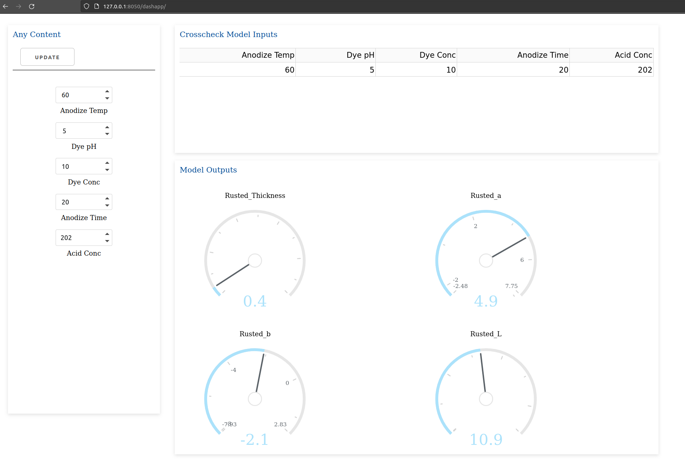

# Interactive App


## App Design


We like to have an app with 2 or 3 Cards. 

The first Card will contain the possibility to upload an app / model config file from where the rest of the app is constructed.

At least the config file should contain the names of the models, and the models will generate the user inputs and the gauges and a table of the inputs and outputs.

So, lets make 3 cards:

- Upload Config File and User Inputs
- Table of Inputs and Outputs
- All Model Outputs as Gauge


### Main App Structure

The starting structure of the app is very simple:

```bash

- .venv
- dashapp
 |- app
   |- pages
   |- utilities
   dash_app.py
  index.py
poetry.lock
poetry.toml
pyproject.toml

```

index.py

```bash

"""Main application file"""

from app.dash_app import app


# assign the server to run in docker and support debugging in vs code
server = app.server


if __name__ == "__main__":
    app.run_server(port=8050, debug=True)

```


dash_app.py

```bash

import dash
from dash import Dash, html, dcc


from flask import Flask

server = Flask(__name__)

url_base_pathname="/dashapp"

app = Dash(
    __name__, 
    server = server,
    url_base_pathname="/dashapp/",
    use_pages=True
    )

app.title = "autogenerated_app"


app.layout = html.Div(
    [
        html.Div(
            [
                dash.page_container
            ],
            className="content",
        ),
    ]
)


```

Now we can build up page by page if we like to have several pages. 
Anyway, this could be a tutorial of its own :) 
We stay with one page and only the inputs out of the MLFlow models

I assume to create an app as own tutorial. 


## Model App

The app is configured by loading a config file once to load the models and to construct all inputs out of the model. 

The App has 3 Cards, one for the User Inputs, one for the Model Inputs to crosscheck and one to create the Model Outputs as Gauges in a structured way.

This App and its content is autogenerated via the models that we pick. Cool stuff. One App for all MLFlow models that we have registed and choosen to work with. :)



Now we can play with he inputs to find a good solution for all of our Targets

```bash

# | Variable   | Target | Spez. Range |     Range    |
# ----------------------------------------------------
# | Thickness  |  0.85  |    0.15     |   1.0 - 0.7  |
# |    L*      |  9.75  |    1.75     |  11.5 - 8.0  |
# |    a*      |  1.5   |    1.5      |   3.0 - 0.0  |
# |    b*      |  0.0   |    1.5      |   1.5 - -1.5 |
# ----------------------------------------------------

```

In the End we get values as set points that we should try to have our quality parameters in the optimal range out of the generic optimization.


```bash

|   Variable   |   Value   |
----------------------------
| Anodize Temp |    76     |
|   Dye pH     |   5.598   |
|   Dye Conc   |  11.262   |
| Anodize time |    37     |
|   Acid Conc  |  204.93   |


|  targets  |  Values |
-----------------------
| Thickness |    0.70 |
|     L*    |    9.72 |
|     a*    |    1.50 |
|     b*    |  - 0.19 |

```

Have you found better values for the process?! 
Or tested the values form the optimal process control script?!


# Conclusions

In this example we have learned:

- Control the MSA of things you like to measure or improve.
- Numbers for quality checks are better than human controls since we can crosscheck nd have reference values
- It could be sufficient to have already the improved setpoints for the process at hand 
- but it also could be useful to update continuously our models and use them for the human operators as learning and teaching tool.

## Recap for me

- Time to write this tutorial several days
- Real time to work on this scenario several weeks / month because the data are not right at the start at hand
- Tool Stack with MLFlow and Blobstorage is quite powerful :)


- Next tutorial: Autogenerated Dash App out of an MLFlow model :)


[Restart](./README.md)