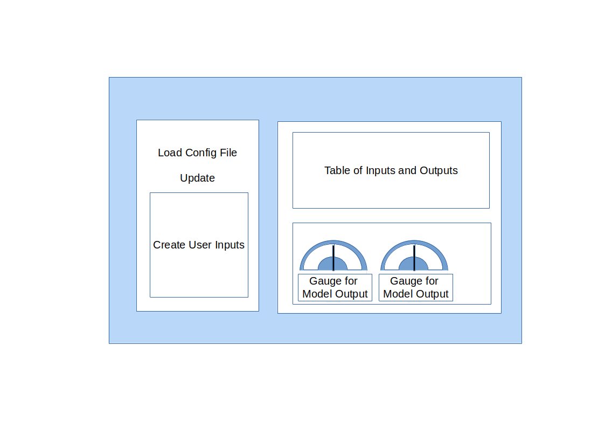

# Interactive App


## App Design



We like to have an app with 2 or 3 Cards. 

The first Card will contain the possibility to upload an app / model config file from where the rest of the app is constructed.

At least the config file should contain the names of the models, and the models will generate the user inputs and the gauges and a table of the inputs and outputs.

So, lets make 3 cards:

- Upload Config File and User Inputs
- Table of Inputs and Outputs
- All Model Outputs as Gauge


### Main App Structure

The starting structure of the app is very simple:

```bash

- .venv
- dashapp
 |- app
   |- pages
   |- utilities
   dash_app.py
  index.py
poetry.lock
poetry.toml
pyproject.toml

```

index.py

```bash

"""Main application file"""

from app.dash_app import app


# assign the server to run in docker and support debugging in vs code
server = app.server


if __name__ == "__main__":
    app.run_server(port=8050, debug=True)

```


dash_app.py

```bash

import dash
from dash import Dash, html, dcc


from flask import Flask

server = Flask(__name__)

url_base_pathname="/dashapp"

app = Dash(
    __name__, 
    server = server,
    url_base_pathname="/dashapp/",
    use_pages=True
    )

app.title = "autogenerated_app"


app.layout = html.Div(
    [
        html.Div(
            [
                dash.page_container
            ],
            className="content",
        ),
    ]
)


```

Now we can build up page by page if we like to have several pages. 
Anyway, this could be a tutorial of its own :) 
We stay with one page and only the inputs out of the MLFlow models


# Conclusions


[Restart](./README.md)