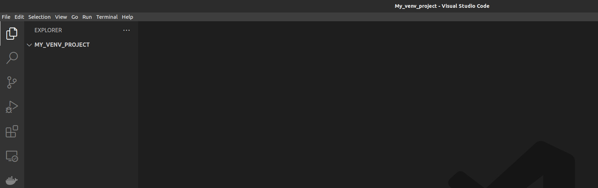
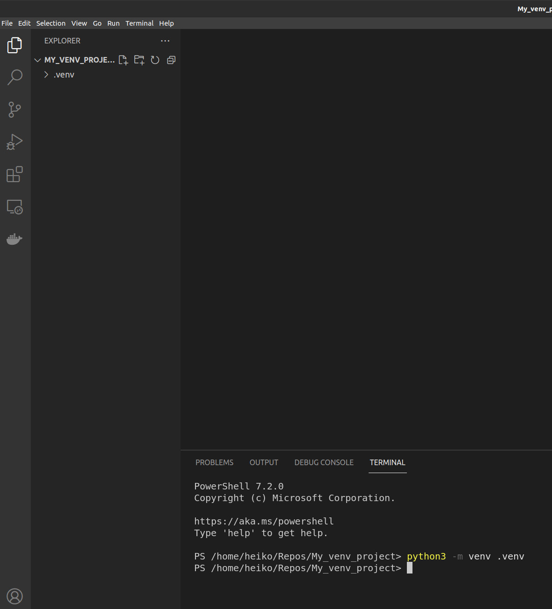
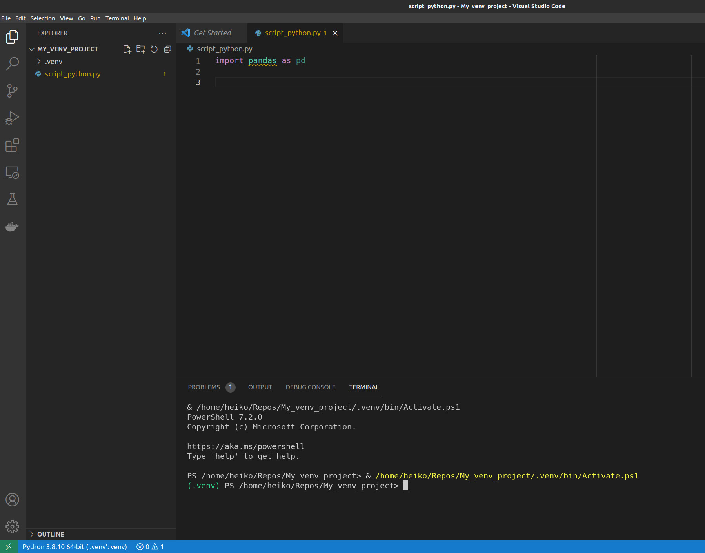
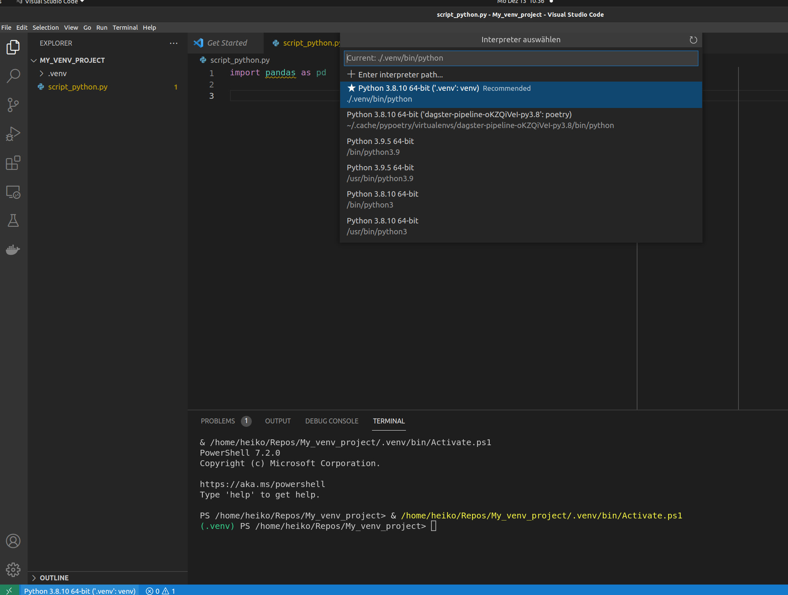

# How to create a virtual environment

We start with a new folder.

So please create a new folder. For me this is *`My_venv_project`* that i will delete afterwards.




We create a new virtual environment with 
```bash 

python3 -m venv .venv

python3 -m pip install --upgrade pip
```

depending on your configuration you may need to execute

```bash

python -m venv .venv

python -m pip install --upgrade pip
```

The second code line is to update pip for the next step already.




Now we need to check into this new virtual environment. Either you switch and activate this by using the commandline or you are lazy like me and you create a very simple python script like:

```bash

import pandas as pd
```
and save it as `pandas_import.py`



At the very bottom you see a small decription like `python 3.8.10 64-bit (".venv": venv) `




```bash
# within the virtual environment

pip install poetry

```

Then we can use poetry to install our depenedencies. 

```bash

poetry init

```

and follow the instructions.


Useful commands for poetry are:

```bash

poetry add any-package-name  # adds a single package to your toml file

poetry install # create and install the venv from a toml file

poetry update # updates the dependencies if things are added or deleted

```

I guess thats the most important things.

Fix and easy.


**Attention:** 
Poetry and Conda don't like each other very much :) 
You should have python available independent to conda to work very well with poetry.

